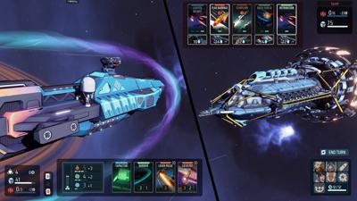
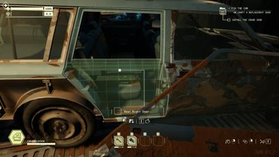

👍
👎 

# TerraTech Worlds

> eh - 20 minutes

I see the appeal of base-building and survival crafting games. They're kinda not my thing. I do like how this one is little rovers that you can build lego pieces on top of along with your base. And it is multiplayer and a pretty world. 

For some reason I remember playing the demo of [Descyned](https://store.steampowered.com/app/1450900/Desynced_Autonomous_Colony_Simulator/) last year and I think it had more bots or automation or something. I can't quite remember why I liked Desynced and TerraTech fell a little flat. I might still want to give TerraTech a chance. 

# Crow Country

> 👍 ~1 hour

I really like the aesthetic and game design here. Like old Resident Evil but with a 360 degree camera and full range of aiming the pistol. The setting of an abandoned zombie-infested amusement park with potentially a secret excavation underneath is great. I paused it only cause I wanted to play more demos and it's mostly puzzle focused run-around. 

https://store.steampowered.com/app/1996010/Crow_Country/

# Island of Insights

> 👎 24 minutes, quit

See I love `Talos Principle 2`. Like 2023 GOTY love it. So I love puzzle games right?

Yeah but actually no. I had a moment with puzzle games when I realized I hated to play `The Witness`. That game is certainly a love letter, but.. puzzle games can be tedious by design sometimes. `Island of Insights` isn't bad, but isn't for me. Yeah it's just a big sandbox with other people running and puzzling but.. oh I hate flat line/block puzzles that could be a mobile game - I don't care if you drop me in Egpytian floating Field of Reeds.

https://store.steampowered.com/app/2071500/Islands_of_Insight/

# Backrooms

> 👎 18 minutes, quit

> 2/7/2024

Got chased by monster. Flipped some switches. Was suprised that I got kinda bored. Meme/viral game. Dead by Daylight is more fun. Lighting, camera, and monster are good, but it lacks all the substance that makes `Amnesia Dark Descent` interesting.

Slenderman was a better game. 

https://store.steampowered.com/app/2714970/Backrooms/

# Breachway

> 👍 1.5 hour, excellent - beyond expectation

> 2/7/2024`

I KNEW this nextfest was gonna rock. Yussssssss. This is an easy addiction. This feels like such a next-of evolution from `Slay the Spire`. I love how `Fights in Tight Spaces` and now `Breachway` are so uniquely themselves in the "card-battler rougelike" genre.

Ok, you ship systems define your cards. Weapons and shields are areas of your ship which give you those cards. Engineering gives you "special cards" like target-lock. Salvaging a ship and stealing their missle bay and adding it to your ship, gives you missle delay next-turn attack cards.

You have points in attack/energy/mass (not quite sure the names). Each card has a cost that pulls from this. Like a simple missle costs 2 attack. A beam sweep, 3 attack + 2 beam. If you don't have enough, you can't play. IF YOU NEED more points, you might have a "rally the troops" action, you get very few of those an entire battle (maybe one or two). OR MY FAVORITE ASPECT, you can divert subsystems for next turn. 

Enemy attacks aren't immediate, you see `pips` (loading bar) on the enemy cards. They stay until they fill up and fire that turn when full. 

Big enemy attack encoming next turn and you're low on energy? Divert subsystem `pips` away from weapons to energy. Do this too much you risk over-heating damage. But do big pulls and often enough, you'll play into cards you keep or discard, or you're getting lucky. It's part chance of the cards and part preperations.

AND some weapons are precision targeting. You might be able to knock out an emeny laser putting into a 3-turn repair cooldown before they can do big damage. So sometimes your cards encourage defense and sometimes offense. It's part of the strat of picking new cards after battles. 

If the story is as detailed as the prologue, it's very promising. And the map after is HUGE. And you get a second ship in the demo!

https://store.steampowered.com/app/2118810/Breachway/

# Pacific Drive

> 👍 2 hour, must-play

> 2/7/2024

oh yeah. This is what I want in a video game. 

You know that part in Half Life 2 where you ran around in the car defending the base from the alien invasion and you thought "huh this is like better than all that shooting I've done for 10 hours, why isn't the game just this?" and then the game wasn't that ever again and valve stopped making video games?

`Pacific Drive` isn't that but it feels even better than that. Your car is damaged goods, you gotta manage fuel and fix why your tire fell off, but all the material gathering makes a ton of sense. Rubber for tire repair kits. Scrap metal down to build up a new door, hood, bumper.

And that's good, like really good and all, but it's not the `drive` (heh) here. It's the `atmosphere`. Alternate history USA where zones of California have been walled off from humankind and you're inside it? Weird sounds coming through your radio? Why are there mannequins in the road and why do they move when I'm not looking? 

Even the interactionable mechanics not being automatic add a lot to the sim-ish nature of the game. It's not simulation focused, but just enough to lead to tense moments when you're threatened.

> Oh... that's going to be a problem. RUn RUN back to the car, open the door, turn the key... TURN THE KEY TURN THE KEY, shift into drive. GO GO GO.

You're stuck in a zone where technology is used to combat || instability. As in grown shifting, tree moving, anomaly producing, that-shouldn't-be-physically-possible instability. || Plus, the character/radio banter between characters who exist here too and are helping you survive is fabulous. 

https://store.steampowered.com/app/1458140/Pacific_Drive/ + [Running with proton](https://www.protondb.com/app/1458140#ivQoPfutKg)

# Star Trucker

> 👍 40 minutes (died, you can rank up to 3, I was 0.8), brilliantly divergent sim

> 2/6/2024

I feel like this could be as zen as Euro/American truck sim (except it's WASD and not my wheel) - but oh this is clever. The up-down deminsion and rotate the ship, maglocks, and general traversal of 3D space is clever. The radio and CB is nice. I was not expecting so many systems internal to the cab, but it kinda makes sense. You can die in your truck/ship. Climate went a bit off and cause I didn't figure out how to fix it, I froze to death. I imagine battery, systems management is a larger role, but I think in a fun way. It wasn't exactly expected. The game could use cruise control :P

https://store.steampowered.com/app/2380050/Star_Trucker/

# Pepper Grinder

> 👍 20 minutes, must-play

> 2/6/2024

What a great demo. Movement is super fun. You can accelerate and coming out of dirt is a little tricky cause you can just fling yourself into death. Avoid spiky traps, bombs, flip switches. Probably the best 2D platformer (outside Mario) I've played in a while.

https://store.steampowered.com/app/2076580/Pepper_Grinder/

