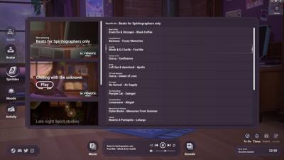
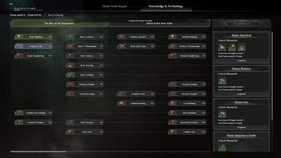
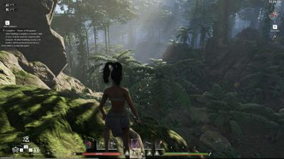
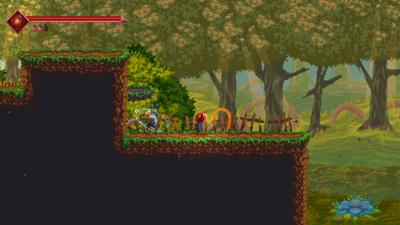
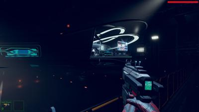
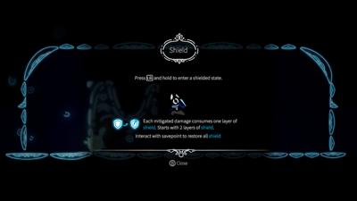
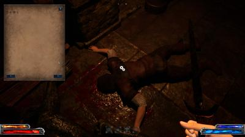

# Nextfest Feb 2024 summary

```
Total: 35 games
Total Playtime: 20 hours
Average Playtime: 30 minutes
```

| Game Title                                         | Total Play Time | Will Purchase |
|----------------------------------------------------|-----------------|---------------|
| [Pacific Drive: Demo](#pacific-drive)              | 2.4 hours       | Yes           |
| [Harold Halibut Demo](#harold-halibut)             | 2.1 hours       | Yes           |
| [Breachway Demo](#breachway)                       | 116 minutes     | Yes           |
| [Until Then Demo](#until-then)                     | 102 minutes     | Yes           |
| [Tokyo Psychodemic Demo](#tokyo-psychodemic)       | 63 minutes      | Yes           |
| [Abiotic Factor](#abiotic-factor)                  | 60 minutes      | Yes           |
| [The Good Life](#the-good-life)                    | 60 minutes      |               |
| [Kamikaze Lassplanes Demo](#kamikaze-lassplanes)   | 60 minutes      | lol           |
| [Beyond Hanwell Demo](#beyond-hanwell)             | 57 minutes      |               |
| [Star Trucker Demo](#star-trucker)                 | 39 minutes      | Yes           |
| [Crow Country Demo](#crow-country)                 | 38 minutes      | Yes           |
| [Eclipsium Demo](#eclipsium)                       | 37 minutes      | Maybe         |
| [Yohane the Parhelion Demo](#yohane-the-parhelion) | 36 minutes      | Maybe         |
| [Albatroz Demo](#albatroz)                         | 35 minutes      |               |
| [Astral Party Demo](#astral-party)                 | 30 minutes      |               |
| [Mouthwashing Demo](#mouthwashing)                 | 30 minutes      | Yes           |
| [ANNO: Mutationem Demo](#anno-mutationem-prologue) | 29 minutes      | Own           |
| [Chasmal Fear Demo](#chasmal-fear)                 | 27 minutes      |               |
| [Soulmask](#soulmask)                              | 27 minutes      |               |
| [Crypt Custodian Demo](#crypt-custodian)           | 26 minutes      |               |
| [Hellskate](#hellskate)                            | 25 minutes      |               |
| [Monomyth Demo](#monomyth)                         | 25 minutes      |               |
| [Islands of Insight Demo](#island-of-insights)     | 24 minutes      |               |
| [ARTIFICIAL Demo](#artificial)                     | 24 minutes      |               |
| [Pepper Grinder Demo](#pepper-grinder)             | 24 minutes      | Yes           |
| [Tribes 3 Rivals](#tribes-3-rivals)                | 22 minutes      | Good          |
| [Children of the Sun Demo](#children-of-the-sun)   | 19 minutes      |               |
| [TerraTech Worlds Demo](#terratech-worlds)         | 19 minutes      |               |
| [Balatro Demo](#balatro)                           | 23 minutes      |               |
| [Backrooms Demo](#backrooms)                       | 17 minutes      |               |
| [Realm of Ink](#realm-of-ink)                      | 15 minutes      |               |
| [Copycat Demo](#copycat)                           | 15 minutes      |               |
| [Deviator Demo](#deviator)                         | 13 minutes      |               |
| [Oriental Valley Demo](#oriental-valley)           | 12 minutes      |               |
| [Spirit City Lofi](#spirit-city-lofi-sessions)     | 10 minutes      | Yes           |
| [Lonely Space Demo](#lonely-space)                 | 10 minutes      |               |
| [Duel Corp. Demo](#duel-corp)                      | 8 minutes       |               |
| [Awake Astral Blade](#awake-astral-blade)          | 7 minutes       |               |
| [Emberbane](#emberbane)                            | 5 minutes       |               |
| [SUMMERHOUSE Demo](#summerhouse)                   | 5 minutes       |               |
| [OtherSide Demo](#otherside-of-mist-and-mountain)  | 2 minutes       |               |
| [Backpack Battles Demo](#backpack-battles)         | 2 minutes       |               |

## CRASHED
    Artifact Seeker
    Spear Song
    Sword of Convallaria (Mobile-first touch controls, quit)

# Hellskate

> 👍 25 minutes (repeatable)

huh. Tony Hawk pro-skater but with enemies as a rogue-like. Who'd have thunk. Fun

https://store.steampowered.com/app/1295630/Helskate/

[](img/2024_feb/hellskate/20240211230508_1.jpg)
[](img/2024_feb/hellskate/20240211230519_1.jpg)
[](img/2024_feb/hellskate/20240211230526_1.jpg)
[](img/2024_feb/hellskate/20240211230642_1.jpg)
[](img/2024_feb/hellskate/20240211230748_1.jpg)
[](img/2024_feb/hellskate/20240211230932_1.jpg)
[](img/2024_feb/hellskate/20240211231141_1.jpg)
[](img/2024_feb/hellskate/20240211232048_1.jpg)
[](img/2024_feb/hellskate/20240211232051_1.jpg)

# Spirit City Lofi Sessions

> 👍 10 minute tinkering

Awesome - so it's lofi beats but you make an avatar and place them around. Rain sounds make it rain outside, fireplace turns on. It looks like it's aiming to have the ability to customize the room further and support a web browser for music. It has a good pomodoro timer, which I just bought a real one lol. 

You find spirits (you start with a cat) and they hang out with you.

https://store.steampowered.com/app/2113850/Spirit_City_Lofi_Sessions/

[](img/2024_feb/spirit_city/20240211224846_1.jpg)
[](img/2024_feb/spirit_city/20240211224859_1.jpg)
[](img/2024_feb/spirit_city/20240211224910_1.jpg)
[](img/2024_feb/spirit_city/20240211224930_1.jpg)
[](img/2024_feb/spirit_city/20240211224939_1.jpg)
[](img/2024_feb/spirit_city/20240211225009_1.jpg)
[](img/2024_feb/spirit_city/20240211225014_1.jpg)
[](img/2024_feb/spirit_city/20240211225043_1.jpg)
[](img/2024_feb/spirit_city/20240211225118_1.jpg)

# Abiotic Factor

> 👍👍👍 66 minutes (took a break)

WHERE DID THIS COME FROM. I am amazed, __AMAZED__ that I found a crafting game I thoroughly enjoy. It just had to be with the literal setting of half-life (and I mean LITERAL, graphics included).

You're a down-for-their-luck scientist duct-taping together whatever you can find to build barricades, throw nets at aliens, and just survive. The chef was dead, I took his hat and knife, crafted some nets and shanked some aliens. Your screwdriver can "package" things you built for transport (into inventory). Your crafting bench must be at a power supply. You can later run power conduits I believe. 

This is a server-hosted multiplayer world like any open-world survival game. This is insane. 

I will make you play this game with me, lol.

https://store.steampowered.com/app/427410/Abiotic_Factor/


[](img/2024_feb/abiotic/20240211214315_1.jpg)
[](img/2024_feb/abiotic/20240211215426_1.jpg)
[](img/2024_feb/abiotic/20240211221022_1.jpg)
[](img/2024_feb/abiotic/20240211221330_1.jpg)
[](img/2024_feb/abiotic/20240211222240_1.jpg)
[](img/2024_feb/abiotic/20240211222251_1.jpg)
[](img/2024_feb/abiotic/20240211223403_1.jpg)
[](img/2024_feb/abiotic/20240211223639_1.jpg)

# The Good Life

> 👍 1 hour +

I thought this was just a farming-sim with animals where you play as an asshole New-York photographer visiting a quaint New York town, but as night fell and all the townspeople || turned into cats and dogs, and you got cursed by a witch to turn into a cat || it was a little different than I expected. It's mission based - and the demo is a prologue so you can keep doing some missions (take photos of this or that, or plant this or whatnot). A labor of love this little game - enough to ignore the jank. 

https://store.steampowered.com/app/1452500/The_Good_Life/

[](img/2024_feb/good_life/20240211194252_1.jpg)
[](img/2024_feb/good_life/20240211194325_1.jpg)
[](img/2024_feb/good_life/20240211194654_1.jpg)
[](img/2024_feb/good_life/20240211194740_1.jpg)
[](img/2024_feb/good_life/20240211194908_1.jpg)
[](img/2024_feb/good_life/20240211200109_1.jpg)
[](img/2024_feb/good_life/20240211202624_1.jpg)
[](img/2024_feb/good_life/20240211203400_1.jpg)
[](img/2024_feb/good_life/20240211203657_1.jpg)
[](img/2024_feb/good_life/20240211203925_1.jpg)
[](img/2024_feb/good_life/20240211204725_1.jpg)
[](img/2024_feb/good_life/20240211204922_1.jpg)

# Tribes 3 Rivals

> 👍, 22 minutes match

Better than `Halo Infinite`. In this game mode "capture the flag" is more "hold the flag" to rack up points or first team to 100 kills. I liked how confined the arena was actually meant the flag passed back and forth a lot. I dropped in behind but we got close in the middle. I was mostly medium loadout (light, medium, heavy). 

I'm not into "play a lot to unlock skins" seasonal stuff EVEN THOUGH they have some just for nextfest. That novelty in games has worn off for me cause it's just everywhere.

https://store.steampowered.com/app/2687970/TRIBES_3_Rivals/

[](img/2024_feb/tribes3/20240211185417_1.jpg)
[](img/2024_feb/tribes3/20240211190010_1.jpg)
[](img/2024_feb/tribes3/20240211190021_1.jpg)

# Soulmask

> not my thing, 27 minutes

Yep it's a survival game. Tribal. I killed a turkey, got chased by some dudes at a shrine, crafted some tools, couldn't figure out how to light a fire, and got killed by a dog. 

You can host a server and play with friends. I gotta give it to em though. A demo that lets you host a server, play as long as you want (I think) and has about 40 hours to get to the level cap is impressive

https://store.steampowered.com/app/2646460/Soulmask/

[](img/2024_feb/soulmask/20240211181337_1.jpg)
[](img/2024_feb/soulmask/20240211181932_1.jpg)
[](img/2024_feb/soulmask/20240211182228_1.jpg)
[](img/2024_feb/soulmask/20240211182611_1.jpg)
[](img/2024_feb/soulmask/20240211182616_1.jpg)
[](img/2024_feb/soulmask/20240211183100_1.jpg)
[](img/2024_feb/soulmask/20240211183416_1.jpg)
[](img/2024_feb/soulmask/20240211183600_1.jpg)
[](img/2024_feb/soulmask/20240211183629_1.jpg)
[](img/2024_feb/soulmask/20240211183714_1.jpg)
[](img/2024_feb/soulmask/20240211183837_1.jpg)
[](img/2024_feb/soulmask/20240211183944_1.jpg)
[](img/2024_feb/soulmask/20240211183947_1.jpg)
[](img/2024_feb/soulmask/20240211184045_1.jpg)

# Realm of Ink

> 👍 mixed, 15 minutes

Chinese Hades clone. According to Codie, not in an overtly problematic way, but she says I should play Hades instead. 

https://store.steampowered.com/app/2597080/Realm_of_Ink/

[](img/2024_feb/realm_ink/20240211174431_1.jpg)
[](img/2024_feb/realm_ink/20240211175615_1.jpg)
[](img/2024_feb/realm_ink/20240211175844_1.jpg)
[](img/2024_feb/realm_ink/20240211175901_1.jpg)

# Emberbane

> 👎 5 minutes

Just didn't have fun. 

https://store.steampowered.com/app/2085310/Emberbane/

[](img/2024_feb/emberbane/20240211173926_1.jpg)
[](img/2024_feb/emberbane/20240211174122_1.jpg)

# Awake Astral Blade

> 👎 7 minutes

Just didn't have fun. Pet a cat though.

https://store.steampowered.com/app/1716310/AWAKEN__Astral_Blade/

[](img/2024_feb/awaken/20240211173428_1.jpg)

# OtherSide of Mist and Mountain

#horror
> 👎 2 minutes - TIED SHORTEST TIME WINNER

Shotty language support, mobile game port. Looks creepy - not going to play it. 

https://store.steampowered.com/app/2672060/The_Other_Side_Of_Mist_And_Mountain/

[](img/2024_feb/otherside/20240210235811_1.jpg)
[](img/2024_feb/otherside/20240210235904_1.jpg)

# Yohane the Parhelion

#cartbattler
> 👍 36 minutes

Anime `Slay The Spire`. Actually kinda cute story where the baker gets sick and you get sucked into a mirror world and fight an evil version of them. Good 3D animations. You recover instead of campfires, by picnics drinking tea. lol

https://store.steampowered.com/app/2459750/Yohane_the_Parhelion__NUMAZU_in_the_MIRAGE/


[](img/2024_feb/yohane/20240210231823_1.jpg)
[](img/2024_feb/yohane/20240210231835_1.jpg)
[](img/2024_feb/yohane/20240210231944_1.jpg)
[](img/2024_feb/yohane/20240210232036_1.jpg)
[](img/2024_feb/yohane/20240210233136_1.jpg)
[](img/2024_feb/yohane/20240210233300_1.jpg)
[](img/2024_feb/yohane/20240210233630_1.jpg)
[](img/2024_feb/yohane/20240210234138_1.jpg)
[](img/2024_feb/yohane/20240210234301_1.jpg)

# Backpack Battles

#autobattler
> 👎 2 minutes - SHORTEST TIME WINNER

I thought this would be like `BackBack Hero` where you rouge-like through a dungeon doing combat. And it has the backpack, but it's an online auto-battler. I died. 

https://store.steampowered.com/app/2427700/Backpack_Battles/

[](img/2024_feb/backpack/20240210231223_1.jpg)

# Valkyrie Saga

#platformer
> mixed, 5 minutes

There's a few n64-graphical-styling games made recently that have the look but the worlds and gameplay surpass what the n64 system is capable of. One example: Pseudoregalia. 

`Valkyrie Saga` has some neat ideas. Your lunge attack propels you further in air. If it catches terrain, you can spring-jump upward. 

The game needs focus and to guide the player in direction. It doesn't have to explicitly tell me where to go, but if I fall down and feel stuck I just give up. 

I hope this game works out for the dev. 

https://store.steampowered.com/app/2663150/Valkyrie_Saga/

[](img/2024_feb/valkyrie_saga/20240210225425_1.jpg)
[](img/2024_feb/valkyrie_saga/20240210225442_1.jpg)
[](img/2024_feb/valkyrie_saga/20240210225608_1.jpg)
[](img/2024_feb/valkyrie_saga/20240210225840_1.jpg)

# Lonely Space

#fps #sim #space
> 👎 10 minutes

I get this is trying to be an immersive sim like `System Shock` but using AI to voice your characters (not just the ship AI, I radio logs of humans) was a nope from me.

https://store.steampowered.com/app/2664120/Lonely_Space/

[](img/2024_feb/lonely_space/20240210224124_1.jpg)
[](img/2024_feb/lonely_space/20240210224315_1.jpg)
[](img/2024_feb/lonely_space/20240210224404_1.jpg)
[](img/2024_feb/lonely_space/20240210224528_1.jpg)

# Anno Mutationem Prologue

#story
> 👍 25 minutes, bought

This game is already out but the Prologue is free. The style is great again with the mix of 2D characters in 3D is really hitting it off lately (`Until Then` and `Star Ocean 2 Remake`).

The combat gameplay is alright, bit tanky enemies, and mostly slash forward and up, but still fun. 

[](img/2024_feb/anno_mutationem/20240210220134_1.jpg)
[](img/2024_feb/anno_mutationem/20240210220205_1.jpg)
[](img/2024_feb/anno_mutationem/20240210220326_1.jpg)
[](img/2024_feb/anno_mutationem/20240210223259_1.jpg)
[](img/2024_feb/anno_mutationem/20240210223317_1.jpg)
[](img/2024_feb/anno_mutationem/20240210221300_1.jpg)
[](img/2024_feb/anno_mutationem/20240210221945_1.jpg)
[](img/2024_feb/anno_mutationem/20240210222237_1.jpg)
[](img/2024_feb/anno_mutationem/20240210222458_1.jpg)

# Deviator

#action #metroidvania
> 👎 13 minutes

I hesitate to mention this game, it just feels like plagiarism. 

What makes `Lies of P` (Bloodborne clone) and `Mina The Hollower` (Zelda Oracle Ages/Seasons-like) actually good, but `Deviator` (Hollow Knight clone) just leaves a bad taste in my mouth. Maybe the former look unique on their own, but `Deviator` you'd just mistake for Hollow Knight. Same biome, art, enemy type, plants, attacks. Bleh.

It has a shield/parry system. to power-up, the only thing that seemed semi-unique about it.

It felt wrong to play still.

https://store.steampowered.com/app/2620730/DEVIATOR/

[](img/2024_feb/deviator/20240210213859_1.jpg)
[](img/2024_feb/deviator/20240210214321_1.jpg)
[](img/2024_feb/deviator/20240210214427_1.jpg)

# Duel Corp

#action
> 👎 8 minutes

If Dark Souls was a PS1 game. Had multiplayer. I wasn't patient enough for it. 

https://store.steampowered.com/app/1804470/Duel_Corp/

[](img/2024_feb/duel_corp/20240210212915_1.jpg)
[](img/2024_feb/duel_corp/20240210213117_1.jpg)
[](img/2024_feb/duel_corp/20240210213336_1.jpg)

# Children of the Sun

#puzzle
> 👍 20 minutes

This one is hard to convey in screenshots, but you kill cultists with a magic bullet that you can re-aim upon kills. It's a puzzle game - `devolver digital` of course. 

https://store.steampowered.com/app/1309950/Children_of_the_Sun/

[](img/2024_feb/children_of_the_sun/20240210210254_1.jpg)
[](img/2024_feb/children_of_the_sun/20240210210332_1.jpg)
[](img/2024_feb/children_of_the_sun/20240210210541_1.jpg)
[](img/2024_feb/children_of_the_sun/20240210210608_1.jpg)
[](img/2024_feb/children_of_the_sun/20240210211805_1.jpg)
[](img/2024_feb/children_of_the_sun/20240210210443_1.jpg)

# Kamikaze Lassplanes

#visualnovel #shmup
> 👍 1 hour

All I attempted to do was ||bone|| an airplane. I don't know why that resulted in a ||global conflict||. IT IS WHAT IT IS.

https://store.steampowered.com/app/2253930/Kamikaze_Lassplanes/

[](img/2024_feb/kamikaze_lassplanes/20240210192349_1.jpg)
[](img/2024_feb/kamikaze_lassplanes/20240210200007_1.jpg)
[](img/2024_feb/kamikaze_lassplanes/20240210202232_1.jpg)
[](img/2024_feb/kamikaze_lassplanes/20240210202539_1.jpg)
[](img/2024_feb/kamikaze_lassplanes/20240210202721_1.jpg)
[](img/2024_feb/kamikaze_lassplanes/20240210204246_1.jpg)
[](img/2024_feb/kamikaze_lassplanes/20240210204345_1.jpg)
[](img/2024_feb/kamikaze_lassplanes/20240210205004_1.jpg)
[](img/2024_feb/kamikaze_lassplanes/20240210205215_1.jpg)

# Until Then

#story
> 👍 1.5+ hours, excellent

This is great. This is really, really great.

Graphically it mixes 2D pixels with a lot of animation, 3D environments and a lot of depth. Interactions on your phone in game are so detailed, down to looking at people's profiles, getting lost reading multiple news articles by continuing to click on "more", and texts and discord chats. 

The gameplay lets you make choices in dialog and play mundanely fun minigames. I've seen someone playing this on #steamdeck to control the phone with touch controls just like real facebook/groupchat/discord.

The storytelling is excellent. Just a mostly lonely, outgoing but likely depressed high schooler. There's a sense of something-more-going-on-and-something-isn't-right in the world, but it's probably just a realistic take on paranoia and anxiety. 

You know when I played `Harold Halibut` my overall thought was I am really-fucking-impressed at where indie gaming as gone. Absolute same feeling playing `Until Then`.

https://store.steampowered.com/app/1574820/Until_Then/

[](img/2024_feb/until_then/Screenshot%20from%202024-02-10%2017-09-18.png)
[](img/2024_feb/until_then/Screenshot%20from%202024-02-10%2017-17-21.png)
[](img/2024_feb/until_then/Screenshot%20from%202024-02-10%2017-21-48.png)
[](img/2024_feb/until_then/Screenshot%20from%202024-02-10%2017-24-41.png)
[](img/2024_feb/until_then/Screenshot%20from%202024-02-10%2017-39-25.png)
[](img/2024_feb/until_then/Screenshot%20from%202024-02-10%2017-46-55.png)
[](img/2024_feb/until_then/Screenshot%20from%202024-02-10%2017-51-03.png)
[](img/2024_feb/until_then/Screenshot%20from%202024-02-10%2018-05-43.png)
[](img/2024_feb/until_then/Screenshot%20from%202024-02-10%2018-12-18.png)
[](img/2024_feb/until_then/Screenshot%20from%202024-02-10%2018-22-14.png)

# Beyond Hanwell

#horror
> alright, 1 hour

Alright, I might have liked this more than Outlast 2, lol. The lighting and sound was really good. It hinted at more an SCP containment theme but it kinda just gave me zombies. I got a bit lost and felt a bit too strong.

https://store.steampowered.com/app/2565550/Beyond_Hanwell/

[](img/2024_feb/beyond_hanwell/20240210155949_1.jpg)
[](img/2024_feb/beyond_hanwell/20240210160612_1.jpg)
[](img/2024_feb/beyond_hanwell/20240210162213_1.jpg)
[](img/2024_feb/beyond_hanwell/20240210162402_1.jpg)
[](img/2024_feb/beyond_hanwell/20240210163016_1.jpg)
[](img/2024_feb/beyond_hanwell/20240210163416_1.jpg)
[](img/2024_feb/beyond_hanwell/20240210163528_1.jpg)
[](img/2024_feb/beyond_hanwell/20240210164623_1.jpg)


# Albatroz

#exploration
> 👍 20-60 minutes, nice

Game crashed, going to give it a pass. This appears to be an open-world hiking/driving game. Girl gets tired of her daily grind, drives for 4 months. Felt a little preachy - but that's the setup: to leave everything behind. She could work on balance a bit. Overall appears to be a positive message of exploration.

I do like this game. World is very pretty, it's kinda if `Breath of the Wild` was set in Colorado and you had a Subaru lol.

https://store.steampowered.com/app/2171880/Albatroz/

[](img/2024_feb/albatroz/20240210150147_1.jpg)
[](img/2024_feb/albatroz/20240210150206_1.jpg)
[](img/2024_feb/albatroz/20240210150252_1.jpg)
[](img/2024_feb/albatroz/20240210150715_1.jpg)
[](img/2024_feb/albatroz/20240210152516_1.jpg)

# Harold Halibut

#story
> 👍👍👍 2 hour, wow

When I booted up this game, I was not prepared for my computer to in-essence fully simulate a stop-animation experience akin to `Coraline` or `Nightmare Before Christmas`. And when I say it is as good as that quality, I mean it is indistinguishably good. Apparently they modeled everything IRL and 3D scanned it in. The animation, I believe, is game engine rather than stop-motion, but it's absolutely brilliant. 

And as mesmerizing as the graphics, the story is absolutely intriguing. You Harold are the maintenance man for a civilization that lives under water. A civilization descendant from a generational sleeper ship that supposedly left at the Earth's demise, but that's just as best you can tell. You do all the errands people don't want to do and people constantly talk down to you and treat you rather poorly. BUT the game is brilliantly funny and it will keep in stitches the whole way. Why is there a ski-shop in underwater-rapture? Don't care it's so funny I had to take a moment. 

Play this game. If this is the future of video games, I am so in.

https://store.steampowered.com/app/924750/Harold_Halibut/

[](img/2024_feb/harold_halibut/20240210134450_1.jpg)
[](img/2024_feb/harold_halibut/20240210120748_1.jpg)
[](img/2024_feb/harold_halibut/20240210120334_1.jpg)
[](img/2024_feb/harold_halibut/20240210121510_1.jpg)
[](img/2024_feb/harold_halibut/20240210125854_1.jpg)
[](img/2024_feb/harold_halibut/20240210130259_1.jpg)
[](img/2024_feb/harold_halibut/20240210124241_1.jpg)
[](img/2024_feb/harold_halibut/20240210134617_1.jpg)

# Tokyo Psychodemic

#story #detective
> 👍 1 hour, an unexpected 180 degree turn

Ok this game gave me a bad first impression, but by the end of it I wanted to keep playing. Roller-coaster this one, so here me out..

At first, I couldn't figure out if this game wants to be about detectives, the coronavirus, murder cases, spontaneous human combustion, or physic cults. WHY would you have a 5 minute video about the coronavirus and instead focus on exploding people? Game seems to imply... that the plot is something in pharmaceuticals both caused the pandemic and is currently exploding people.. Look it's a lot in 5 minutes alright.

HOWEVER. I - the faceless-unnamed protagonist - am known for solving unsolvable cases. And I don't play by the rules of ethics. I have the dark web lol. 

Once the gamed dropped me into my shitty appartment with my cute girfriend and dumped all the case evidence in my lap, it got a bit interesting. The game mixes beautifully animated 2D character art, 3D game environments, and real-life surveillance footage. Yeah that's right, this murder is real photography and human actors. 

The gameplay is mostly scrubbing through the photos and videos, finding matches, asking your dark-web friends for technical details (like the flash point of ethenol). It's actually a pretty dope interface of 3 monitors and juggling taking screenshots, posting, and pinning on your board to locations and questions. I dig it.

https://store.steampowered.com/app/2397140/TOKYO_PSYCHODEMIC/

[](img/2024_feb/tokyopsychodemic/20240209232559_1.jpg)
[](img/2024_feb/tokyopsychodemic/20240209233336_1.jpg)
[](img/2024_feb/tokyopsychodemic/20240209233744_1.jpg)
[](img/2024_feb/tokyopsychodemic/20240209234412_1.jpg)
[](img/2024_feb/tokyopsychodemic/20240210000621_1.jpg)
[](img/2024_feb/tokyopsychodemic/20240210000533_1.jpg)
[](img/2024_feb/tokyopsychodemic/20240210001541_1.jpg)
[](img/2024_feb/tokyopsychodemic/20240210001741_1.jpg)

# Oriental Valley

#farming #sim
> 👎 10 minutes

lol I don't know why I didn't take `Oriental Valley` to mean Chinese language only. For a farming sim, I actually really dig this setting and vibe. As a teenager visiting your grandma, she has a very modern house in a town. This would be dope as a complete harvest-moon-like if it had interesting characters. Farming land, aquatic, greenhouses - is pretty nice.

But as a demo, it has placeholder characters and I bought seeds and they didn't go into my inventory (were they delivered?)

https://store.steampowered.com/app/2201930/Oriental_Valley/

[](img/2024_feb/oriental_valley/20240209230057_1.jpg)
[](img/2024_feb/oriental_valley/20240209230320_1.jpg)
[](img/2024_feb/oriental_valley/20240209230841_1.jpg)
[](img/2024_feb/oriental_valley/20240209230609_1.jpg)
[](img/2024_feb/oriental_valley/20240209230826_1.jpg)

# Chasmal Fear

#horror
> 👎 mixed, 26 minutes

Dang I want to like this one, but I kinda can't. 

Pros: I love the underwater facility setting and how creepy it is. The lighting and slow ackwardness of your underwater suit is great. The environment looks great.

Cons: While the fisheye helmet looks good, it gave me a headache. And the enemies were jank. If they were animated in a creepy cool way - look the original `Dead Space` necromorphs had better animations, these zombies just ran at your face. My gun glitched out of my hands and I ran out of ammo and got lost and quit. I gave it a solid run.

Maybe polish up the enemy movement and allow a larger FOV and you might have something.

https://store.steampowered.com/app/2597570/Chasmal_Fear/

[](img/2024_feb/chasmal_fear/20240209222638_1.jpg)
[](img/2024_feb/chasmal_fear/20240209222809_1.jpg)
[](img/2024_feb/chasmal_fear/ss_8c76a758ecb412b2c675730a77d3abe8404174bd.1920x1080.jpg)

# Monomyth

#combat
> 👎 25 minutes

It aint' `Delicious in Dungeon`. It's ok but like I got stuck not being able to attach something to make a new lever work. Also I failed at stealth but could kill enemies cause they didn't move past some wooden planks. I love the idea of western dungeon crawlers, but they loose all the fun when compared to `Etrian Odyssey` which is also on steam so..

https://store.steampowered.com/app/908360/Monomyth/

[](img/2024_feb/monomyth/20240209215409_1.jpg)
[](img/2024_feb/monomyth/20240209220510_1.jpg)
[](img/2024_feb/monomyth/20240209220951_1.jpg)

# Eclipsium

#horror
> 👍 37 minutes

If you take shrooms while camping, you might find yourself in Mordor being tracked by Sauron.

I do like environmental horror where when you exit a room and turn around it's a burned house or a different places. And this game was a good horror trip. Now, I understand that chunky pixels and low-res is a stylistic choice, but do it so much I have trouble understanding that I'm looking at a lever and you might have gone too far. But overall this was good. 

https://store.steampowered.com/app/2419670/Eclipsium/

[](img/2024_feb/eclipsium/20240209210004_1.jpg)
[](img/2024_feb/eclipsium/20240209210407_1.jpg)
[](img/2024_feb/eclipsium/20240209212209_1.jpg)
[](img/2024_feb/eclipsium/20240209213517_1.jpg)
[](img/2024_feb/eclipsium/20240209213531_1.jpg)

# Crypt Custodian

#combat #2d
> alright, 25+ minutes

As a cat in the afterlife, you become the janitor for reasons. You don't janitor as much as smack enemies with a broom. It's a cute metroidvania but I got a little bored. 

https://store.steampowered.com/app/2394650/Crypt_Custodian/

[](img/2024_feb/crypt_custodian/20240209202927_1.jpg)
[](img/2024_feb/crypt_custodian/20240209203421_1.jpg)
[](img/2024_feb/crypt_custodian/20240209203732_1.jpg)

# Astral Party

#boardgame #marioparty
> 👎 30 minutes

No amount of anime titties is gonna save you from being a mario party clone without minigames. It was OK. Though I kinda liked that you collected cards for fights when you ran into other characters - the board is go any direction, so you can set traps for enemies. It was still a bit too long and boring. 

https://store.steampowered.com/app/2622000/Astral_Party/


[](img/2024_feb/astral_party/20240209202420_1.jpg)
[](img/2024_feb/astral_party/20240209201935_1.jpg)
[](img/2024_feb/astral_party/20240209200953_1.jpg)
[](img/2024_feb/astral_party/20240209200928_1.jpg)
[](img/2024_feb/astral_party/20240209201809_1.jpg)
[](img/2024_feb/astral_party/20240209195424_1.jpg)

# Copycat

#sim
> 👎 15 mintues

If stray was a bad game and boring. And glitchy. Never made it outside

https://store.steampowered.com/app/1622350/Copycat/

[](img/2024_feb/copycat/20240209194724_1.jpg)

# Balatro

#roguelike #cardbattler
> 👍 23+ minutes

Poker as a rougelike. Play as many poker hands as possible to beat the blind amount which keeps increasing. Poker hands and multipliers, joker cards do special things like multiply 3-of-a-kind. Tarot cards do things like upgrade cards. You buy cards in a shop. Not bad at all. 

https://store.steampowered.com/app/2379780/Balatro/

[](img/2024_feb/balatro/20240209184108_1.jpg)

# Mouthwashing

#horror
> 👍 30 minutes

What. The. Everliving. Fuck.

10/10

https://store.steampowered.com/app/2475490/Mouthwashing/
https://www.destructoid.com/mouthwashing-is-sublime-space-horror-that-burrows-into-your-brain/

[](img/2024_feb/mouthwashing/20240209175230_1.jpg)
[](img/2024_feb/mouthwashing/20240209175518_1.jpg)
[](img/2024_feb/mouthwashing/20240209180556_1.jpg)
[](img/2024_feb/mouthwashing/20240209180704_1.jpg)
[](img/2024_feb/mouthwashing/20240209180817_1.jpg)
[](img/2024_feb/mouthwashing/20240209181250_1.jpg)
[](img/2024_feb/mouthwashing/20240209181226_1.jpg)

# Artificial

#puzzle
> mixed - 25 minutes

If garbage was a planet and walking itself was a puzzle. Each item has weight and where you drag it from matters. It's that one half-life 2 physics puzzle and portal turrets that aim at you but an entire game. Throw bricks at turrets, build trash bridges, die in ooze. It's alright. Narrator's a bit deadpan.

https://store.steampowered.com/app/904510/ARTIFICIAL/

[](img/2024_feb/artificial/20240209173402_1.jpg)
[](img/2024_feb/artificial/20240209173802_1.jpg)

# Summerhouse

#cozy
> 😕 5 minutes

Yep I built a house. Nice fast editor with mouse, pretty, not really a "game". That's ok. 

https://store.steampowered.com/app/2533960/SUMMERHOUSE/

[](img/2024_feb/summerhouse/20240209170432_1.jpg)
[](img/2024_feb/summerhouse/20240209170917_1.jpg)
[](img/2024_feb/summerhouse/20240209170710_1.jpg)

# TerraTech Worlds

#basebuilding
> eh - 20 minutes

I see the appeal of base-building and survival crafting games. They're kinda not my thing. I do like how this one is little rovers that you can build lego pieces on top of along with your base. And it is multiplayer and a pretty world. 

For some reason I remember playing the demo of [Descyned](https://store.steampowered.com/app/1450900/Desynced_Autonomous_Colony_Simulator/) last year and I think it had more bots or automation or something. I can't quite remember why I liked Desynced and TerraTech fell a little flat. I might still want to give TerraTech a chance. 

[](img/2024_feb/terratech/20240209164718_1.jpg)
[](img/2024_feb/terratech/20240209164745_1.jpg)
[](img/2024_feb/terratech/20240209164038_1.jpg)
[](img/2024_feb/terratech/20240209165335_1.jpg)

# Crow Country

#horror
> 👍 ~1 hour

I really like the aesthetic and game design here. Like old Resident Evil but with a 360 degree camera and full range of aiming the pistol. The setting of an abandoned zombie-infested amusement park with potentially a secret excavation underneath is great. I paused it only cause I wanted to play more demos and it's mostly puzzle focused run-around. 

https://store.steampowered.com/app/1996010/Crow_Country/

[](img/2024_feb/crow_country/20240209155624_1.jpg)
[](img/2024_feb/crow_country/20240209161459_1.jpg)
[](img/2024_feb/crow_country/20240209162459_1.jpg)

# Island of Insights

#puzzle
> 👎 24 minutes, quit

See I love `Talos Principle 2`. Like 2023 GOTY love it. So I love puzzle games right?

Yeah but actually no. I had a moment with puzzle games when I realized I hated to play `The Witness`. That game is certainly a love letter, but.. puzzle games can be tedious by design sometimes. `Island of Insights` isn't bad, but isn't for me. Yeah it's just a big sandbox with other people running and puzzling but.. oh I hate flat line/block puzzles that could be a mobile game - I don't care if you drop me in Egpytian floating Field of Reeds.

https://store.steampowered.com/app/2071500/Islands_of_Insight/

[](img/2024_feb/islandinsights/islandinsights.jpg)

# Backrooms

#horror
> 👎 18 minutes, quit

> 2/7/2024

Got chased by monster. Flipped some switches. Was suprised that I got kinda bored. Meme/viral game. Dead by Daylight is more fun. Lighting, camera, and monster are good, but it lacks all the substance that makes `Amnesia Dark Descent` interesting.

Slenderman was a better game. 

https://store.steampowered.com/app/2714970/Backrooms/

[](img/2024_feb/backrooms/20240207230528_1.jpg)

# Breachway

#roguelike #cardbattler #space
> 👍 1.5 hour, excellent - beyond expectation

> 2/7/2024`

I KNEW this nextfest was gonna rock. Yussssssss. This is an easy addiction. This feels like such a next-of evolution from `Slay the Spire`. I love how `Fights in Tight Spaces` and now `Breachway` are so uniquely themselves in the "card-battler rougelike" genre.

Ok, you ship systems define your cards. Weapons and shields are areas of your ship which give you those cards. Engineering gives you "special cards" like target-lock. Salvaging a ship and stealing their missle bay and adding it to your ship, gives you missle delay next-turn attack cards.

You have points in attack/energy/mass (not quite sure the names). Each card has a cost that pulls from this. Like a simple missle costs 2 attack. A beam sweep, 3 attack + 2 beam. If you don't have enough, you can't play. IF YOU NEED more points, you might have a "rally the troops" action, you get very few of those an entire battle (maybe one or two). OR MY FAVORITE ASPECT, you can divert subsystems for next turn. 

Enemy attacks aren't immediate, you see `pips` (loading bar) on the enemy cards. They stay until they fill up and fire that turn when full. 

Big enemy attack encoming next turn and you're low on energy? Divert subsystem `pips` away from weapons to energy. Do this too much you risk over-heating damage. But do big pulls and often enough, you'll play into cards you keep or discard, or you're getting lucky. It's part chance of the cards and part preperations.

AND some weapons are precision targeting. You might be able to knock out an emeny laser putting into a 3-turn repair cooldown before they can do big damage. So sometimes your cards encourage defense and sometimes offense. It's part of the strat of picking new cards after battles. 

If the story is as detailed as the prologue, it's very promising. And the map after is HUGE. And you get a second ship in the demo!

https://store.steampowered.com/app/2118810/Breachway/

[](img/2024_feb/breachway/20240207211706_1.jpg)
[](img/2024_feb/breachway/20240207210125_1.jpg)
[](img/2024_feb/breachway/20240207211619_1.jpg)
[](img/2024_feb/breachway/20240207220619_1.jpg)

# Pacific Drive

#survival #racing #sim
> 👍 2 hour, must-play

> 2/7/2024

oh yeah. This is what I want in a video game. 

You know that part in Half Life 2 where you ran around in the car defending the base from the alien invasion and you thought "huh this is like better than all that shooting I've done for 10 hours, why isn't the game just this?" and then the game wasn't that ever again and valve stopped making video games?

`Pacific Drive` isn't that but it feels even better than that. Your car is damaged goods, you gotta manage fuel and fix why your tire fell off, but all the material gathering makes a ton of sense. Rubber for tire repair kits. Scrap metal down to build up a new door, hood, bumper.

And that's good, like really good and all, but it's not the `drive` (heh) here. It's the `atmosphere`. Alternate history USA where zones of California have been walled off from humankind and you're inside it? Weird sounds coming through your radio? Why are there mannequins in the road and why do they move when I'm not looking? 

Even the interactionable mechanics not being automatic add a lot to the sim-ish nature of the game. It's not simulation focused, but just enough to lead to tense moments when you're threatened.

> Oh... that's going to be a problem. RUn RUN back to the car, open the door, turn the key... TURN THE KEY TURN THE KEY, shift into drive. GO GO GO.

You're stuck in a zone where technology is used to combat || instability. As in grown shifting, tree moving, anomaly producing, that-shouldn't-be-physically-possible instability. || Plus, the character/radio banter between characters who exist here too and are helping you survive is fabulous. 

https://store.steampowered.com/app/1458140/Pacific_Drive/ + [Running with proton](https://www.protondb.com/app/1458140#ivQoPfutKg)

[](img/2024_feb/pacific_drive/20240207151057_1.jpg)
[](img/2024_feb/pacific_drive/20240207154924_1.jpg)
[](img/2024_feb/pacific_drive/20240207161139_1.jpg)
[](img/2024_feb/pacific_drive/20240207152643_1.jpg)
[](img/2024_feb/pacific_drive/20240207153012_1.jpg)
[](img/2024_feb/pacific_drive/20240207153135_1.jpg)
[](img/2024_feb/pacific_drive/20240207155822_1.jpg)
[](img/2024_feb/pacific_drive/20240207160810_1.jpg)

# Star Trucker

#sim #space
> 👍 40 minutes (died, you can rank up to 3, I was 0.8), brilliantly divergent sim

> 2/6/2024

I feel like this could be as zen as Euro/American truck sim (except it's WASD and not my wheel) - but oh this is clever. The up-down deminsion and rotate the ship, maglocks, and general traversal of 3D space is clever. The radio and CB is nice. I was not expecting so many systems internal to the cab, but it kinda makes sense. You can die in your truck/ship. Climate went a bit off and cause I didn't figure out how to fix it, I froze to death. I imagine battery, systems management is a larger role, but I think in a fun way. It wasn't exactly expected. The game could use cruise control :P

https://store.steampowered.com/app/2380050/Star_Trucker/

[](img/2024_feb/star_trucker/20240206211843_1.jpg)
[](img/2024_feb/star_trucker/20240206215204_1.jpg)
[](img/2024_feb/star_trucker/20240206212132_1.jpg)

# Pepper Grinder

#action #puzzle
> 👍 20 minutes, must-play
> 2/6/2024

What a great demo. Movement is super fun. You can accelerate and coming out of dirt is a little tricky cause you can just fling yourself into death. Avoid spiky traps, bombs, flip switches. Probably the best 2D platformer (outside Mario) I've played in a while.

https://store.steampowered.com/app/2076580/Pepper_Grinder/

[](img/2024_feb/pepper/pepper.jpg)
[](img/2024_feb/pepper/pepper2.jpg)

# Didn't Attempt

    Awake - Astral Blade
    Lightyear Frontier
    Zero Below Sum
    Submersed 2 The Hive
    Cryptmaster
    Arco
    Emberbane
    Eden's Guardian
    Omega crafter
    Soulmask
    Sword of Convallaria
    Realm of Ink
    Artifact Seeker
    TRIBES 3: Rivals