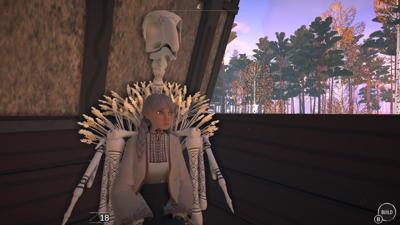

# nextfest June 2024
## summary

| Game Title                                         | Total Play Time | Will Purchase | Type                                       |
|----------------------------------------------------|-----------------|---------------|--------------------------------------------|
| [REKA](#reka)                                      | 38+ minutes     | Yes           | #adventure #crafting #horror?              |
| [Just Crow Things](#just-crow-things)              | 35 minutes      |               | #simulation #comedy #adventure             |
| [Pools](#pools)                                    | 10 minutes      |               | #liminal #walking-simulator #horror        |

| [Sky Oceans](#sky-oceans-wings-for-hire)           |                 |               | #adventure #simulation                     |
| [Kill Knight](#kill-knight)                        |                 |               | #action #adventure                         |
| [Neko Odyssey](#neko-odyssey)                      |                 |               | #adventure #simulation                     |
| [Dungeons of Hinterberg](#dungeons-of-hinterberg)  |                 |               | #rpg #adventure                            |
| [Hollowbody](#hollowbody)                          |                 |               | #horror #adventure                         |
| [Once Human](#once-human)                          |                 |               | #survival #multiplayer                     |
| [On Your Tail](#on-your-tail)                      |                 |               | #action #adventure                         |
| [Beyond Galaxyland Prologue](#beyond-galaxyland)   |                 |               | #adventure #sci-fi                         |
| [SCHiM](#schim)                                    |                 |               | #puzzle #platformer                        |
| [Caravan SandWitch](#caravan-sandwitch)            |                 |               | #strategy #simulation                      |
| [SULFUR](#sulfur)                                  |                 |               | #adventure #action                         |
| [The Alters](#the-alters)                          |                 |               | #adventure #sci-fi                         |
| [Tactical Breach Wizards](#tactical-breach-wizards)|                 |               | #strategy #turn-based                      |
| [Steel Seed](#steel-seed)                          |                 |               | #action #adventure                         |
| [Metal Slug Tactics](#metal-slug-tactics)          |                 |               | #strategy #tactics                         |
| [Test Drive Unlimited](#test-drive-unlimited)      |                 |               | #racing #simulation                        |
| [Tavern Talk](#tavern-talk)                        |                 |               | #simulation #role-playing                  |
| [Crashlands 2](#crashlands-2)                      |                 |               | #adventure #crafting                       |
| [Mirthwood](#mirthwood)                            |                 |               | #adventure #role-playing                   |
| [Goblin Cleanup](#goblin-cleanup)                  |                 |               | #action #adventure                         |
| [Moon Mystery](#moon-mystery)                      |                 |               | #adventure #sci-fi                         |
| [Riven](#riven)                                    |                 |               | #adventure #puzzle                         |
| [Office Fight](#office-fight)                      |                 |               | #action #multiplayer                       |

# REKA

- **Steam Page**: [REKA](https://store.steampowered.com/app/1737870/REKA/)
- **Total Play Time**: 38+ minutes
- **Will Purchase**: Yes
- **Type**: #crafting #horror?

> 🕹️ **Description**: A crafting (survival?) game but your house is on a giant chicken and you're a witch that controls crows. 
> 
> 👍 **Feedback**: Rumors are there's a witch at the edge of town in the woods. So of course, you do her errands and resurrect a giant chicken house and become her witch apprentice. The Slavic dream is more alive than the American one. I particuarly liked how you command the crows to pick up crafting material. And even though I'm not a crafting/building genre fan, I'll play this one for the atmosphere alone. 

# Just Crow Things

- **Steam Page**: [Just Crow Things](https://store.steampowered.com/app/2537920/Just_Crow_Things/)
- **Total Play Time**: 35 minutes
- **Type**: #simulation #comedy #adventure

> 🕹️ **Description**: Play as a crow
>
> 👍 **Feedback**: Funny game with cute aesthetic and flying/pooping mechanics. Next-fest part caught on fire. A fairly "my first game" vibe, but funny like [Rain on Your Parade](https://store.steampowered.com/app/1213230/Rain_on_Your_Parade/)

# Pools

- **Total Play Time**: 10 minutes
- **Type**: #liminal #walking-simulator #horror

> 👍 **Feedback**: This game is surprisingly terrifying. It just took one tile covered room with the ceiling a bit too low.
