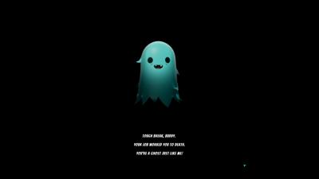
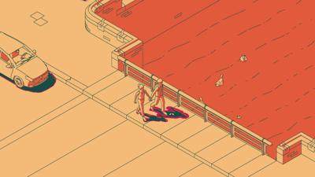
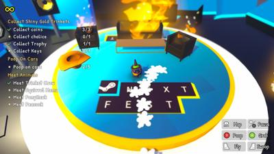

# nextfest June 2024
## summary

| Game Title                                         | Total Play Time | Will Purchase | Type                                       |
|----------------------------------------------------|-----------------|---------------|--------------------------------------------|
| [Caravan SandWitch](#caravan-sandwitch)            | 45 minutes      | Yes           | #adventure                                 |
| [REKA](#reka)                                      | 38+ minutes     | Yes           | #adventure #crafting #horror?              |
| [Just Crow Things](#just-crow-things)              | 35 minutes      |               | #simulation #comedy #adventure             |
| [SCHiM](#schim)                                    | 26 minutes      |               | #puzzle #platformer                        |
| [Office Fight](#office-fight)                      | 14 minutes      |               | #action                                    |
| [Pools](#pools)                                    | 10 minutes      |               | #liminal #walking-simulator #horror        |
| [Kill Knight](#kill-knight)                        | 5 minutes       |               | #action #shooter                           |

| [Sky Oceans](#sky-oceans-wings-for-hire)           |                 |               | #adventure #simulation                     |
| [Neko Odyssey](#neko-odyssey)                      |                 |               | #adventure #simulation                     |
| [Dungeons of Hinterberg](#dungeons-of-hinterberg)  |                 |               | #rpg #adventure                            |
| [Once Human](#once-human)                          |                 |               | #survival #multiplayer                     |
| [On Your Tail](#on-your-tail)                      |                 |               | #action #adventure                         |
| [Beyond Galaxyland Prologue](#beyond-galaxyland)   |                 |               | #adventure #sci-fi                         |
| [SULFUR](#sulfur)                                  |                 |               | #adventure #action                         |
| [The Alters](#the-alters)                          |                 |               | #adventure #sci-fi                         |
| [Tactical Breach Wizards](#tactical-breach-wizards)|                 |               | #strategy #turn-based                      |
| [Steel Seed](#steel-seed)                          |                 |               | #action #adventure                         |
| [Metal Slug Tactics](#metal-slug-tactics)          |                 |               | #strategy #tactics                         |
| [Test Drive Unlimited](#test-drive-unlimited)      |                 |               | #racing #simulation                        |
| [Tavern Talk](#tavern-talk)                        |                 |               | #simulation #role-playing                  |
| [Crashlands 2](#crashlands-2)                      |                 |               | #adventure #crafting                       |
| [Mirthwood](#mirthwood)                            |                 |               | #adventure #role-playing                   |
| [Goblin Cleanup](#goblin-cleanup)                  |                 |               | #action #adventure                         |
| [Moon Mystery](#moon-mystery)                      |                 |               | #adventure #sci-fi                         |
| [Riven](#riven)                                    |                 |               | #adventure #puzzle                         |
| [Enotria](#enotria)                                |                 |               |                                            |
| [Afterlove EP](#afterlove-ep)                      |                 |               |                                            |
| [Trace Hunters](#trace-hunters)                    |                 |               |                                            |
| [Demonschool](#demonschool)                        |                 |               |                                            |
| [Honeycomb: The World Beyond](#honeycomb)          |                 |               |                                            |
| [Mind Over Magnet](#mind-over-magnet)              |                 |               |                                            |
| [Seafrog](#seafrog)                                |                 |               |                                            |
| [Tiny Glade](#tiny-glade)                          |                 |               |                                            |
| [One Btn Bosses](#one-btn-bosses)                  |                 |               |                                            |
| [The Rise of the Golden Idol](#golden-idol)        |                 |               |                                            |
| [The Big Catch Tacklebox](#the-big-catch-tacklebox)|                 |               |                                            |
| [Thank Goodness You're Here](#thank-goodness-youre-here) |                 |               |                                            |
| [Freaked Fleapit](#freaked-fleapit)                |                 |               |                                            |
| [Uncle Chop's Rocket Shop](#uncle-chops-rocket-shop) |                 |               |                                            |

# Caravan SandWitch

- **Steam Page**: [Caravan SandWitch](https://store.steampowered.com/app/1582650/Caravan_SandWitch/)
- **Total Play Time**: 45 minutes
- **Will Purchase**: Yes
- **Type**: #adventure  

> 🕹️ **Description**: Van-life
>
> 👍👍👍 **Feedback**: I love this! Ah, it's like a cozier zelda exploration game with a van. Your sister sends out a distress signal, so you return to your home planet. You're waiting for your dad, so you're slowly reconvening with old friends. The van has attachments like scanning for jammers that block communication. I noticed there was a large under-ground cave system near the starting town to return to later. This is probably my most anticitpated indie game. 

# Office Fight

- **Steam Page**: [Office Fight](https://store.steampowered.com/app/2747060/Office_Fight/)
- **Total Play Time**: 14 minutes
- **Will Purchase**: 
- **Type**: #action 

> 🕹️ **Description**: Throw things at office workers
>
> **Feedback**: Pass. Dang.. the vibe is good but the gameplay is meh. As a ghost (dead ex-employee), you fling objects at coworkers to start fights and most mayhem causes most points. Like.. I dunno, destruction golf? And the boss fight was flinging a ghost around. It looked good but was like a.. not that fun mini game.   

# Kill Knight

- **Steam Page**: [Kill Knight](https://store.steampowered.com/app/2694420/KILL_KNIGHT/)
- **Total Play Time**: 
- **Will Purchase**: 
- **Type**: #action #adventure

> 🕹️ **Description**: Shootyshoot
>
> **Feedback**: Pass. I can understand the appeal of enemy horde, but small arena combat/shooter things hasn't been my thing. You juggle combos, reload timers, heavy ammo, swords - all sorts of crap at the same time which can either be rewarding or just.. a bit much.  

# SCHiM

- **Steam Page**: [SCHiM](https://store.steampowered.com/app/1519710/SCHiM/)
- **Total Play Time**: 26 minutes
- **Type**: #puzzle #platformer

> 🕹️ **Description**: Frog jumping from shadows.
>
> **Feedback**: Mixed. Aesthetic, I love this. But I'm not sure I was having much fun cause "jump shadow to shadow" doesn't have much complexity. I found more complexity in `I am Fish` where I was just rolling a fishbowl. Plus the "story" was weirdly depressing. You're a frog in a human's shadow and you start at let's say 8 years old, then you graduate, then you get a girlfriend, break up, get a job, get fired, then get separated from your frog shadow. I guess the frog shadow represents "happiness" cause your human sure is depressed. Look, it's kinda a cool experience, but I think it gets a pass from me. 

# REKA

- **Steam Page**: [REKA](https://store.steampowered.com/app/1737870/REKA/)
- **Total Play Time**: 38+ minutes
- **Will Purchase**: Yes
- **Type**: #crafting #horror?

> 🕹️ **Description**: A crafting (survival?) game but your house is on a giant chicken and you're a witch that controls crows. 
> 
> 👍 **Feedback**: Rumors are there's a witch at the edge of town in the woods. So of course, you do her errands and resurrect a giant chicken house and become her witch apprentice. The Slavic dream is more alive than the American one. I particuarly liked how you command the crows to pick up crafting material. And even though I'm not a crafting/building genre fan, I'll play this one for the atmosphere alone. 

# Just Crow Things

- **Steam Page**: [Just Crow Things](https://store.steampowered.com/app/2537920/Just_Crow_Things/)
- **Total Play Time**: 35 minutes
- **Type**: #simulation #comedy #adventure

> 🕹️ **Description**: Play as a crow
>
> 👍 **Feedback**: Funny game with cute aesthetic and flying/pooping mechanics. Next-fest part caught on fire. A fairly "my first game" vibe, but funny like [Rain on Your Parade](https://store.steampowered.com/app/1213230/Rain_on_Your_Parade/)

# Pools

- **Total Play Time**: 10 minutes
- **Type**: #liminal #walking-simulator #horror

> **Feedback**: This game is surprisingly terrifying. It just took one tile covered room with the ceiling a bit too low.
