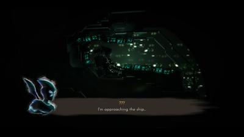
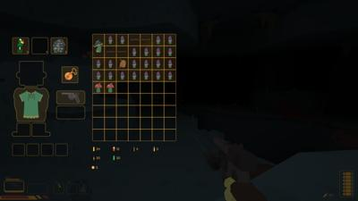
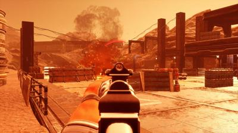
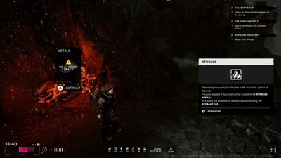
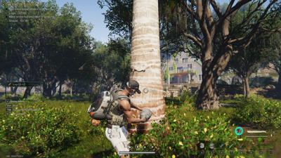
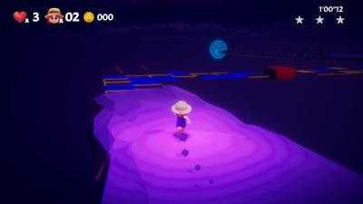
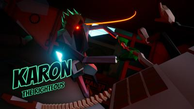
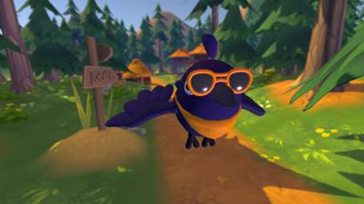

# nextfest June 2024
## summary

| Game Title                                                | Total Play Time | Will Purchase | Type                                       |
|-----------------------------------------------------------|-----------------|---------------|--------------------------------------------|
| [Demonschool](#demonschool)                               | 3 hours         | Yes           | #simulation #strategy #casual              |
| [The Alters](#the-alters)                                 | 108 minutes     | Yes           | #survival #adventure #sci-fi               |
| [Tactical Breach Wizards](#tactical-breach-wizards)       | 81 minutes      | Yes           | #strategy #turn-based                      |
| [Sky Oceans](#sky-oceans-wings-for-hire)                  | 63 minutes      | Yes           | #adventure #rpg #turn-based                |
| [Dungeons of Hinterberg](#dungeons-of-hinterberg)         | 46 minutes      | Yes           | #rpg #adventure                            |
| [Moon Mystery](#moon-mystery)                             | 46 minutes      |               | #adventure #sci-fi                         |
| [Caravan SandWitch](#caravan-sandwitch)                   | 45 minutes      | Yes           | #adventure                                 |
| [SULFUR](#sulfur)                                         | 43 minutes      | Yes           | #action #roguelike #fps                    |
| [REKA](#reka)                                             | 38+ minutes     | Yes           | #adventure #crafting #horror?              |
| [Just Crow Things](#just-crow-things)                     | 35 minutes      |               | #simulation #comedy #adventure             |
| [Once Human](#once-human)                                 | 33 minutes      |               | #survival #multiplayer                     |
| [Beyond Galaxyland](#beyond-galaxyland)                   | 31 minutes      | Yes           | #adventure #rpg #turn-based                 |
| [Mind Over Magnet](#mind-over-magnet)                     | 30 minutes      |               | #puzzle #platformer                        |
| [SCHiM](#schim)                                           | 26 minutes      |               | #puzzle #platformer                        |
| [Thank Goodness You're Here](#thank-goodness-youre-here)  | 15 minutes      |               | #humor #surreal #casual #puzzle            |
| [Office Fight](#office-fight)                             | 14 minutes      |               | #action                                    |
| [Pools](#pools)                                           | 10 minutes      |               | #liminal #walking-simulator #horror        |
| [One Btn Bosses](#one-btn-bosses)                         | 15 minutes      |               | #action #arcade #indie                     |
| [Happy Birthday](#happy-birthday)                         | 5 minutes       |               | #platformer #horror                        |
| [Kill Knight](#kill-knight)                               | 5 minutes       |               | #action #shooter                           |
| [Test Drive Unlimited](#test-drive-unlimited)             | 0               |               | #racing #simulation                        |

# Beyond Galaxyland

- **Steam Page**: [Beyond Galaxyland](https://store.steampowered.com/app/1543710/Beyond_Galaxyland/)
- **Total Play Time**: 31 minutes
- **Will Purchase**: Yes
- **Type**: #adventure #rpg #turn-based

> 🕹️ **Description**: Space-faring turn-based RPG
> 
> 👍👎  **Feedback**: This indie 2D sprite artstyle in a 3D world ala [Until Then](https://store.steampowered.com/app/1574820/Until_Then/) and [Anno: Mutationem](https://store.steampowered.com/app/1368030/ANNO_Mutationem/) is really crushing it right now. And started with `Octopath Traveler` then `Live a Live` and `Star Ocean 2` - it just looks so good.
> 
> The RPG combat has some block timings akin to `Paper Mario`. I got a bit confused with the traversal arrows until I realized UP and DOWN didn't mean vertically but mean foreground and background. Then I was fine. The demo was short but the game looks like it goes to really different places, seems pretty cool. 

# SULFUR

- **Steam Page**: [SULFUR](https://store.steampowered.com/app/2124120/SULFUR/)
- **Total Play Time**: 43 minutes
- **Will Purchase**: Yes
- **Type**: #action #roguelike #fps

> 🕹️ **Description**: Purgatory Roguelike
> 
> 👍  **Feedback**: You're a priest whose church congregation got wiped out by an evil witch and is stuck in purgatory. You're running through a cave system fighting goblins with just barely enough ammo in your dirk. You have a magic talisman that helps you remember what happens across time-loops as you forget every run. You also have a katana - apparently
> 
> This was just fun. The enemies are 2D sprites and well animated and explode-y. It got tough when I ran low on ammo (maybe I should have warped out and spent money?). There's a progression in repairing, upgrading - if you put items in a particular chest, you can access it on the next run or at the church (the hub before doing a run). 
> 
> Eat your mushrooms for health. 
> 
> I'll probably come back for another few runs. 

# Demonschool

- **Steam Page**: [Demonschool](https://store.steampowered.com/app/1900250/Demonschool/)
- **Total Play Time**: 3 hours
- **Will Purchase**: Yes
- **Type**: #simulation #strategy #casual

> 🕹️ **Description**: Tactical persona-like
> 
> 👍👍👍 **Feedback**: This was surprisingly good. Your 4 characters and demon enemies are sorta like chess pieces. You can move and attack so long as you have AP (action points) remaining. Side-stepping is a free move. This means sometimes you need to kill as many enemies as quick as possible, sometimes you need to shove them around and back-off. One character is good at heavy strikes. One is good with lighter but more frequent strikes. One character can't fight, but can run through a line of enemies and stun them a turn. One character also can't fight, but can buff your party members. 
> 
> I play a good amount of tactics games. This one is tight and fast. If you kill the required number of enemies (usually 8-12), you can run to the top-side and seal the portal rather than fight the remaining demon spawn. 
> 
> And it's in the backdrop of a high school and town where you wander around and progress morning, evening, night of the day with an story "arc" being a week. Very cool game.

# Moon Mystery

- **Steam Page**: [Moon Mystery](https://store.steampowered.com/app/1933840/Moon_Mystery/)
- **Total Play Time**: 46 minutes
- **Type**: #adventure #sci-fi

> 🕹️ **Description**: no idea what's going on: the demo
>
> 👎 **Feedback**: Pass. First, this game ran like ass. Low settings killed all the atmosphere. Let's set that aside. Brave idea to have you demo jump between chapters with no context to see varied gameplay. And it was varied. Just bad. I shot robots on mars (not fun). I played tennis with a robot. I got the wing of a fighter pilot spaceship stuck on a banister... I ran at 5 fps. I controlled a moon buggy. Ran across glaciers. Piloted a submarine. I think my family misses me?
> 
> It wasn't particularly fun..

# Tactical Breach Wizards

- **Steam Page**: [Tactical Breach Wizards](https://store.steampowered.com/app/1043810/Tactical_Breach_Wizards/)
- **Total Play Time**: 81 minutes
- **Will Purchase**: Yes
- **Type**: #strategy #turn-based

> 🕹️ **Description**: It's in the title.
> 
> 👍👍 **Feedback**: Fast-paced, tactical strategy game - but you're wizards. One wizard can predict 1 second ahead (see next turn) and decide if it's good or bad to follow through. The game has a limited rewind in that sense. One wizard can push enemis out windows, or fly through other windows on a broom. 
> 
> The dialogue before breaches and in-between missions is hilarious. It's all in modern area (so your enemies have guns). It's really fun too boot. 

# The Alters

- **Steam Page**: [The Alters](https://store.steampowered.com/app/1601570/The_Alters/)
- **Total Play Time**: 108 minutes
- **Will Purchase**: Yes
- **Type**: #survival #adventure #sci-fi

> 🕹️ **Description**: Survival on a hostile planet
>
> 👍👍👍 **Feedback**: You crash land on a hostile alien planet. You're the sole survivor. You barely make it through nightly radiation spike to "the base".
>
> The base is a giant balancing wheel with habitat modules that can be arranged in squares. The game presents itself as a #survival game where you gather resources on the planet to build modules like a much needed kitchen. One cool part of scanning and mining for resources, is when you find certain materials, you can hook like pipelines from the source to your base.
> 
> But its clear this base was meant to run with a crew and you won't make it on your own.
> 
> You need to move the thing, or the sun is going to fry you in 8 days. 
> 
> Spoilers: Cause what the game presents isn't what it's really about. || You find that the corporation that sent you has kept a fully brain scan of yourself in a quantum computer. And one of the modules is a cloning machine. But you don't simply clone yourself. Oh no. You look at your life's timeline and find significant "branches" that result in you being a different person. You didn't go to college. The version of you that did became a technician. Your engine is broken. You see where this is going. The name is `The Alters`. ||
> 
> || In the demo, you clone a version of you that can fix the engine. They're have their own unique memories. They aren't too happy to be pulled into reality to be a tool, but in some ways they are curious to know how their life worked out in your branch. This game is going to be about having a crew of your selves: technician, scientist, botanist, etc. ||
> 
> It's clearly largely focused on the story more than anything and it's a really exciting one. 
> 
> Game also looks amazing. Almost makes me want a new GPU too, but I could run it at 1080p, FSR-3 medium settings.

# Sky Oceans: Wings for Hire

- **Steam Page**: [Sky Oceans: Wings for Hire](https://store.steampowered.com/app/1691750/Sky_Oceans_Wings_for_Hire/)
- **Total Play Time**: 1 hour, 3 min
- **Will Purchase**: Yes
- **Type**: #adventure #rpg #turn-based    

> 🕹️ **Description**: Indie Skies of Arcadia
> 
> 👍👍 **Feedback**: `Skies of Arcadia` is one of my favorite RPGs. Anyone attempting to replicate it's #turn-based ship combat gets my attention. I was a little unsure cause the combat starts a bit easy and repetitive, but when the enemy attacks and you're scrambling to retreat - and they could take me out in 2 hits.. well it both got tough and rather fun. It had a few "am I supposed to die here cause this boss is overpowered?" moments that.. no you're trying to survive. 
> 
> The story is good too. It starts light-hearted, your friends in the pilot academy are reaching their final exam. There will be a big celebration. But in the backdrop, your dad "died" a few years ago, your mom is a recluse. She misses your pilot graduation and feels bad. The "alliance" empire attacks your town looking for your mom (oh she's hiding something of course) - but she comes to rescue your ass and escape to save the town, so the enemy pursues you. 
> 
> As an indie game, it gets a pass on a few critique: I do wish the camera was a bit further back on the character and the character portrait art is fantastic, but clashes with an ever-smiling simple 3D model that just needs to frown occasionally. Maybe that's a WIP. Also `Skies of Arcadia` is really excellent cause it has character combat and dungeons as well as aerial combat, and this game is gonna feel a little lacking if its just one. However, you do fly around much faster and engage in monsters with advantage/disadvantage as opposed to random encounters. 

# Once Human

- **Steam Page**: [Once Human](https://store.steampowered.com/app/2139460/Once_Human/)
- **Total Play Time**: 33 minutes
- **Type**: #survival #multiplayer

> 🕹️ **Description**: Jank game
> 
> 👎 **Feedback**: When I first saw this I was hyped. It has a cool vibe, somewhere between Control and Stranger Things. But it didn't run well on my machine. And intro melee combat wasn't fun. And it dropped me into survival crafting that... already feels a step behind something like PalWorld (though I've not played). Basically it had a slim chance to be interesting to me. It's not. Nothing spawned in the world though I ran past the "build a x" tutorial is probably why. 

# Happy Birthday

- **Steam Page**: [Happy Birthday](https://store.steampowered.com/app/2847210/Happy_Birthday/)
- **Total Play Time**: 9 minutes
- **Type**: #indie

> 🕹️ **Description**: ???
>
> 👎 **Feedback**: A fucking terrible game.

# ONE BTN BOSSES

- **Steam Page**: [ONE BTN BOSSES](https://store.steampowered.com/app/1910600/ONE_BTN_BOSSES/)
- **Total Play Time**: 15 minutes
- **Type**: #action #arcade #indie

> 🕹️ **Description**: Press one button, change direction
> 
> 👍 **Feedback**: You're on a track. Usually a circle, sometimes a line with a teleport at the ends. If you press a button, you change direction but your shooting slows down. The less you press, the faster and more shooty you are and the bosses need to be killed fast. Risk/reward to ride it out a near miss or change tap-tap-tap direction. Fun music

# Thank Goodness You're Here

- **Steam Page**: [Thank Goodness You're Here](https://store.steampowered.com/app/2366980/Thank_Goodness_Youre_Here/)
- **Total Play Time**: 15 minutes
- **Will Purchase**: Yes
- **Type**: #humor #surreal #casual #puzzle

> 🕹️ **Description**: You're one little guy. Just play this blind.
>
> 👍 **Feedback**: What the fuck did I just play. || Ok so you're a little guy in a town. You slap things. People are weird. I fell into a beer keg. I murdered flowers with a lawn mower. I rescued a guy with his hand stuck in a grate reaching for a penny by giving him butter. || 10/10

# Dungeons of Hinterberg

- **Steam Page**: [Dungeons of Hinterberg](https://store.steampowered.com/app/1983260/Dungeons_of_Hinterberg/)
- **Total Play Time**: 45
- **Will Purchase**: Yes
- **Type**: #rpg #adventure

> 🕹️ **Description**: Smash together Earthbound, Zelda, Mario Galaxy, Tony Hawk and Persona.. into a good game?
>
> 👍 **Feedback**: Well this game is dope. It's an RPG in the modern world (ala Earthbound), but with magic. You fly around on a magic sword/snowboard, shoot magic beams, fight monsters with a sword, and do dungeon things. The dungeon started as a ski resort and then morphed into a Mario-Galaxy style puzzle planet adventure. Then I returned to the town of Hinterberg with time to kill ala Persona. And it was fun the whole time? Interesting.

# Test Drive Unlimited Solar Crown

Does not run in proton. :( Was a 45GB download..
https://store.steampowered.com/app/1249970/Test_Drive_Unlimited_Solar_Crown/
https://www.protondb.com/app/1249970?device=any

# Mind Over Magnet

- **Steam Page**: [Mind Over Magnet](https://store.steampowered.com/app/2685900/Mind_Over_Magnet/)
- **Total Play Time**: 30 minutes
- **Type**: #puzzle #platformer #indie

> 🕹️ **Description**: Puzzle game where you flip switches for magnet flow, an hold/drop a magnet for movement
>
> 👍 **Feedback**: Fun, polished little platformer puzzle. Pretty good

# Caravan SandWitch

- **Steam Page**: [Caravan SandWitch](https://store.steampowered.com/app/1582650/Caravan_SandWitch/)
- **Total Play Time**: 45 minutes
- **Will Purchase**: Yes
- **Type**: #adventure  

> 🕹️ **Description**: Van-life
>
> 👍👍👍 **Feedback**: I love this! Ah, it's like a cozier zelda exploration game with a van. Your sister sends out a distress signal, so you return to your home planet. You're waiting for your dad, so you're slowly reconvening with old friends. The van has attachments like scanning for jammers that block communication. I noticed there was a large under-ground cave system near the starting town to return to later. This is probably my most anticitpated indie game. 

# Office Fight

- **Steam Page**: [Office Fight](https://store.steampowered.com/app/2747060/Office_Fight/)
- **Total Play Time**: 14 minutes
- **Will Purchase**: 
- **Type**: #action 

> 🕹️ **Description**: Throw things at office workers
>
> 👎 **Feedback**: Pass. Dang.. the vibe is good but the gameplay is meh. As a ghost (dead ex-employee), you fling objects at coworkers to start fights and most mayhem causes most points. Like.. I dunno, destruction golf? And the boss fight was flinging a ghost around. It looked good but was like a.. not that fun mini game.   

# Kill Knight

- **Steam Page**: [Kill Knight](https://store.steampowered.com/app/2694420/KILL_KNIGHT/)
- **Total Play Time**: 
- **Will Purchase**: 
- **Type**: #action #adventure

> 🕹️ **Description**: Shootyshoot
>
> 👎 **Feedback**: Pass. I can understand the appeal of enemy horde, but small arena combat/shooter things hasn't been my thing. You juggle combos, reload timers, heavy ammo, swords - all sorts of crap at the same time which can either be rewarding or just.. a bit much.  

# SCHiM

- **Steam Page**: [SCHiM](https://store.steampowered.com/app/1519710/SCHiM/)
- **Total Play Time**: 26 minutes
- **Type**: #puzzle #platformer

> 🕹️ **Description**: Frog jumping from shadows.
>
> 👎 **Feedback**: Mixed. Aesthetic, I love this. But I'm not sure I was having much fun cause "jump shadow to shadow" doesn't have much complexity. I found more complexity in `I am Fish` where I was just rolling a fishbowl. Plus the "story" was weirdly depressing. You're a frog in a human's shadow and you start at let's say 8 years old, then you graduate, then you get a girlfriend, break up, get a job, get fired, then get separated from your frog shadow. I guess the frog shadow represents "happiness" cause your human sure is depressed. Look, it's kinda a cool experience, but I think it gets a pass from me. 

# REKA

- **Steam Page**: [REKA](https://store.steampowered.com/app/1737870/REKA/)
- **Total Play Time**: 38+ minutes
- **Will Purchase**: Yes
- **Type**: #crafting #horror?

> 🕹️ **Description**: A crafting (survival?) game but your house is on a giant chicken and you're a witch that controls crows. 
> 
> 👍 **Feedback**: Rumors are there's a witch at the edge of town in the woods. So of course, you do her errands and resurrect a giant chicken house and become her witch apprentice. The Slavic dream is more alive than the American one. I particuarly liked how you command the crows to pick up crafting material. And even though I'm not a crafting/building genre fan, I'll play this one for the atmosphere alone. 

# Just Crow Things

- **Steam Page**: [Just Crow Things](https://store.steampowered.com/app/2537920/Just_Crow_Things/)
- **Total Play Time**: 35 minutes
- **Type**: #simulation #comedy #adventure

> 🕹️ **Description**: Play as a crow
>
> 👍 **Feedback**: Funny game with cute aesthetic and flying/pooping mechanics. Next-fest part caught on fire. A fairly "my first game" vibe, but funny like [Rain on Your Parade](https://store.steampowered.com/app/1213230/Rain_on_Your_Parade/)

# Pools

- **Total Play Time**: 10 minutes
- **Type**: #liminal #walking-simulator #horror

> **Feedback**: This game is surprisingly terrifying. It just took one tile covered room with the ceiling a bit too low.
