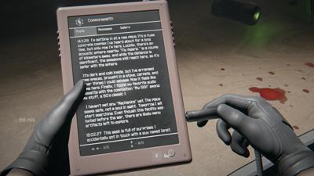

# nextfest October 2024
## summary

| Game Title                                                            | Total Play Time | Will Purchase | Type                                        |
|-----------------------------------------------------------------------|-----------------|---------------|---------------------------------------------|
| [AI LIMIT](#ai-limit)                                                 | 100 minutes     | Likley        | soulslike                                   |
| [Knights in Tight Spaces Demo](#knights-in-tight-spaces-demo)         | 46 minutes      | YES           | srategy                                     |
| [Hail to the Rainbow Demo](#hail-to-the-rainbow-demo)                 | 39 minutes      |               | adventure horror puzzle                     |
| [Metal Bringer](#metal-bringer)                                       | 35 minutes      | Yes           | action, rougelike                           |
| [Carnival Massacre](#carnival-massacre)                               | 27 minutes      |               | horror                                      |
| [Erenshor](#erenshor)                                                 | 26 minutes      |               | simulation, mmorpg                          |
| [Is this Game Trying to Kill Me](#is-this-game-trying-to-kill-me)     | 25 minutes      |               | puzzle, horror                              |
| [ROGUE FLIGHT](#rogue-flight)                                         | 20 minutes      | Yes           | action, arcade, flight, shooter             |
| [Doom Survivors](#doom-survivors)                                     | 19 minutes      |               | survivors                                   |

# Hail to the Rainbow Demo

- **Steam Page**: [Hail to the Rainbow Demo](https://store.steampowered.com/app/3089050/Hail_to_the_Rainbow_Demo/)
- **Total Play Time**: 39 minutes
- **Will Purchase**: 
- **Type**: adventure horror puzzle

> 🕹️ **Description**: Someone looked at `Pacific Drive`, `Stalker` and `Generation Zero` and combined it
> 
> 🫱  **Feedback**: POTENTIAL. It's an apocolyptic adventure game. A bit obtuse, I felt not smart enough and stuck on progression - but it's just hard to realize "put the puzzle cube in the hole" to open the door when the robot is attacking you. It's a neat atmosphere, something about humans and brainwaves being able to be read as visual signals. The narrator (guide?) is in Russian so reading subtitles while driving is difficult (dev is Russian, gets a pass). 
> 
> It's weirdly polished and not. Polished in graphics and atmosphere, but it doesn't explain enough. I wasted a lot of time trying to climb into a drain pipe with a jump and I just couldn't make a 2 feet ledge. The drone is great, but I didn't see the switch. I didn't see the.. whatever turned back on the car was on the ceiling?
> 
> `Pacific Drive` really hooked me - it was a bit Half-Life-ey and arcadey. This is more subdued, subtle - not in a bad way. It shows promise, but I came out a little frustrated. 

# ROGUE FLIGHT

- **Steam Page**: [ROGUE FLIGHT](https://store.steampowered.com/app/2784620/ROGUE_FLIGHT/)
- **Total Play Time**: 20 minutes
- **Will Purchase**: Yes
- **Type**: action, arcade, flight, shooter

> 🕹️ **Description**: An arcade space combat game inspired by prestige anime.
> 
> 👍  **Feedback**: What first caught my attention about this game was a song in the trailer I couldn't find until I read "Featuring an original soundtrack..
> 
> It's funny how starfox shooters are hit and miss (I didn't like Whisker Squadron) - this is not a roguelike. It's just fun and it has solid world building. Earth is nearly wiped out by its own automated fleet but 3 years later they come across an underground R&D facility with some fighters that survived orbital bombardment. SO hop to it, pew-pew!
> 
> Name feels like a play on `Rogue Squadron`.
> 
> https://www.youtube.com/watch?v=yEdL3zB5u_Y

# Knights in Tight Spaces Demo

- **Steam Page**: [Knights in Tight Spaces Demo](https://store.steampowered.com/app/2781230/Knights_in_Tight_Spaces_Demo/)
- **Total Play Time**: 46 minutes
- **Will Purchase**: YES
- **Type**: srategy

> 🕹️ **Description**: Fights in tight spaces, but Dungeons and Dragons
> 
> 👍👍👍 **Feedback**: HELL YES. Now I love `Fights in Tight Spaces` and I got so excited when I saw this. This was my #1 anticipated demo; I almost forgot to take screenshots while playing. It shares the same DNA as the first game. You have a very small grid and pull random cards that let you side-step, attack, range attack, add block (take hits without damage), etc. 
> 
> What this sequel adds is a party and its pretty different. When you control one character, you're focused on dodging or attacking or throwing enemies out of the arena. When you have a party, MORE enemies can be thrown at you and your shared (3) ability limit really matters. Maybe you'd like to heavy attack, but your other character is about to get massacred. Maybe you can push an enemy from one character to another and hit them with a ranged attack for the third.
> 
> I freaking love this series. This one is so colorful - used to be stylistically cartoony where the world was white, and characters were colored in. Characters still color coded, but the world is also in color. 
> 
> It's a roguelike so I died at the mid-boss, so I might try again. 

# Carnival Massacre

- **Steam Page**: [Carnival Massacre](https://store.steampowered.com/app/2304730/Carnival_Massacre/)
- **Total Play Time**: 27 minutes
- **Will Purchase**: 
- **Type**: horror

> 🕹️ **Description**: Bit too resident evil?
> 
> 👎  **Feedback**: I liked the atmosphere. I could even do tank controls on a keyboard. But there's a reason zombies are slow in RE and starting me off with alice knife slashers and giant turantulas and dying was a quick turn off. I might revist if I have more patience - I do WANT to like this. 
> 
> Crow Country was WAY better paced.

# AI LIMIT

- **Steam Page**: [AI LIMIT](https://store.steampowered.com/app/2407270/AI_LIMIT/)
- **Total Play Time**: 100 minutes
- **Will Purchase**: Likley
- **Type**: soulslike

> 🕹️ **Description**: A somewhat generic, OK soulslike
> 
> 👍  **Feedback**: At first this kinda didn't run well - which somehow fixed itself (demo jank is ignored). And it's pretty generic and bland for an anime-soulslike in a sewer fighting corrupted things and walking passed depressed people. Plays like Dark Souls 3, not sekiro. It let me choose weapons, so I got dual blades. And then it gave me a parry ability. I had fun with the last boss and it ends surfacing on the top world. Props for unlocking a boss rush afterwards with a new boss that's a bit too tough for me today.
> 
> I'd say I feel kinda mixed on it, but I did return to it to beat it. If you've run out of soulslikes, it's decent. If you haven't run out, maybe play those instead? Good demo though.

# Doom Survivors

- **Steam Page**: [Doom Survivors](https://store.steampowered.com/app/2746830/Doom_Survivors/)
- **Total Play Time**: 19 minutes
- **Will Purchase**: 
- **Type**: survivors

> 🕹️ **Description**: A passable survivors game
> 
> 🫱 **Feedback**: Not sure if passable is a compliment. Not sure if this one even really had a theme. 

# Erenshor

- **Steam Page**: [Erenshor](https://store.steampowered.com/app/2382520/Erenshor/)
- **Total Play Time**: 26 minutes
- **Will Purchase**: 
- **Type**: simulation, mmorpg

> 🕹️ **Description**: Simulated MMORPG
> 
> 🫱 **Feedback**: Yep if my party would stop pulling shit behind me, we could have made it through the first dunegon. This is fully simulated and offline, even people that log on/off and join your party are programmed NPCs. Kinda reminds me of .hack with retro PC graphics. Neat and fills same itch as an mmorpg, but kinda a novelty too. Though I could see this getting interesting.

# Is this Game Trying to Kill Me

- **Steam Page**: [Is this Game Trying to Kill Me](https://store.steampowered.com/app/2658470/Is_this_Game_Trying_to_Kill_Me/)
- **Total Play Time**: 25 minutes
- **Will Purchase**: 
- **Type**: puzzle, horror

> 🕹️ **Description**: Play a game at a computer and in your room at the same time.
> 
> 👍  **Feedback**: Similiar to [Suffer the Night](https://store.steampowered.com/app/2176850/Suffer_The_Night/) where you play a computer game. Except this one blends the 2D computer puzzles more with elements in the room. I felt pretty stuck for example not having an UP button (on a DPAD in the game), to realize I had a button outside in the room. It's clear that you go into more rooms and maybe the game changes as you progress. Pretty clever. The deaths are great, when you die in the game (like drowning), you're thrown into the same thing IRL. 

# Metal Bringer

- **Steam Page**: [Metal Bringer](https://store.steampowered.com/app/2334170/Metal_Bringer/)
- **Total Play Time**: 35 minutes (offers more)
- **Will Purchase**: Yes
- **Type**: action

> 🕹️ **Description**: You awake from cryo-sleep 1000 years to a world where few humans live underground. Grab a mech and hop to trying to find your mom.
> 
> 👍  **Feedback**: You can customize the hell out of your character, colors, attributes, and swords and guns. But you're weak. A mech consists of legs and a head, and two arms and probably more. As you fight other mechs and defeat them, you can swap out any of your parts on the fly. 
> 
> Which is important cause I didn't really watch this and broke my two arms. So I didn't last long without an weapons. So knowing when to use certain ARMS and when to swap is key. But it's a rougelike, so you can just do a run again.

