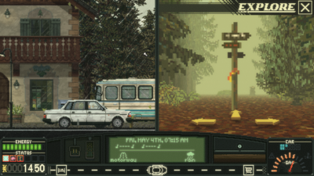
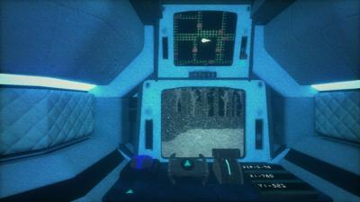
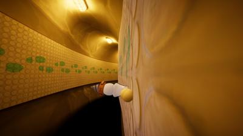
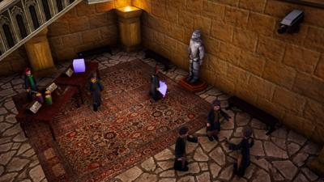
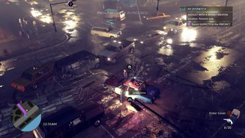
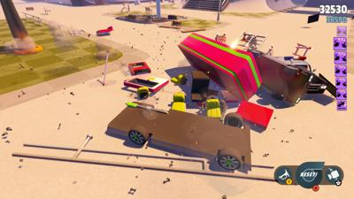
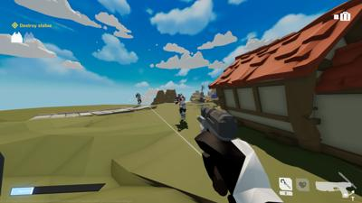

# nextfest October 2024
## summary

| Game Title                                                            | Total Play Time | Will Purchase | Type                                        |
|-----------------------------------------------------------------------|-----------------|---------------|---------------------------------------------|
| [AI LIMIT](#ai-limit)                                                 | 100 minutes     | Likley        | soulslike                                   |
| [Orbos Exodus](#orbos-exodus)                                         | 64 minutes      |               | platformer                                  |
| [Knights in Tight Spaces Demo](#knights-in-tight-spaces-demo)         | 46 minutes      | YES           | srategy                                     |
| [Hail to the Rainbow Demo](#hail-to-the-rainbow-demo)                 | 39 minutes      |               | adventure horror puzzle                     |
| [Fear The Timeloop Demo](#fear-the-timeloop-demo)                     | 39 minutes      |               | horror, puzzle                              |
| [Massacre at the Mirage](#massacre-at-the-mirage)                     | 38 minutes      |               | horror, simulation                          |
| [The Precinct Demo](#the-precinct-demo)                               | 37 minutes      |               | shooter, top-down                           |
| [Keep Driving](#keep-driving)                             | 37 minutes      |               | puzzle                                      |
| [Metal Bringer](#metal-bringer)                                       | 35 minutes      | Yes           | action, rougelike                           |
| [Carnival Massacre](#carnival-massacre)                               | 27 minutes      |               | horror                                      |
| [Erenshor](#erenshor)                                                 | 26 minutes      |               | simulation, mmorpg                          |
| [Is this Game Trying to Kill Me](#is-this-game-trying-to-kill-me)     | 25 minutes      |               | puzzle, horror                              |
| [Abaddons Veil](#abaddons-veil)                           | 23 minutes      |               | horror, simulation                          |
| [CLONY](#clony)                                                       | 21 minutes      |               | puzzle                                      |
| [ROGUE FLIGHT](#rogue-flight)                                         | 20 minutes      | Yes           | action, arcade, flight, shooter             |
| [Doom Survivors](#doom-survivors)                                     | 19 minutes      |               | survivors                                   |
| [Secret Agent Wizard Boy and the International Crime Syndicate Demo](#secret-agent-wizard-boy-and-the-international-crime-syndicate-demo)| 14 minutes      |               | adventure, parody                           |
| [Secret Agent No 6](#secret-agent-no-6)                               | 10 minutes      |               | fps, retro, horror?                         |
| [Turbo Dismount 2](#turbo-dismount-2)                                 | 10 minutes      |               | racing                                      |
| [PLUG IT IN](#plug-it-in)                                             | 9 minutes       |               | puzzle                                      |
| [Splintered](#splintered)                                             | 8 minutes       |               | rpg                                         |
| [World of Unlit](#world-of-unlit)                                     | 7 minutes       |               | fps                                         |

# Keep Driving

- **Steam Page**: [Keep Driving](https://store.steampowered.com/app/2756920/Keep_Driving/)
- **Total Play Time**: 37 minutes
- **Will Purchase**: 
- **Type**: puzzle

> 🕹️ **Description**: Modern day Oregon Trail.
> 
> 👍🫱  **Feedback**: Mixed. So basically Oregon Trail but driving and when "events" happen you play a little game of dragging cards to destroy symbols. More people in your car, extra card but you're trying to help them to some objective like a side mission. You balance resources like money, food in trunk, gas, energy level etc.
> 
> Little mixed, I just found this game tedious. Music was nice, but I think the demo broke on music. It is a casual sort of game.
> 
> If real life was like this, I'd probably never go out.

# Abaddons Veil

- **Steam Page**: [Abaddons Veil](https://store.steampowered.com/app/2476040/Abaddons_Veil/)
- **Total Play Time**: 23 minutes
- **Will Purchase**: 
- **Type**: horror, simulation

> 🕹️ **Description**: You control the worlds worst vehicle after being sucked into a black hole
> 
> 👎 **Feedback**: I wanted to like this, the atmosphere was great. You control your broken vehicle and the ship controls aren't told to you, but I realized I can zoom in/out the sonar and take images. I found some other ships. It takes a lot of patience as bumping walls will send you spinning. Unforunately I couldn't make it to the marked locations on the map cause the wheel stopped turning right - I do think that is a bug. The wheel and lever to go forward is mouse driven - makes it difficult to use on purpose. I could put up with tedious if it was consistent. Unforunately I didn't really get far enough to see anything interesting. 
> 
> Don't get me wrong, jank movement and controls can add to the atmosphere of a surivival horror. But it can also just be not fun. 
> 
> `Scavenger SV-4` does this but better and the rover is still jank to use.

# Orbos Exodus

- **Steam Page**: [Orbos Exodus](https://store.steampowered.com/app/3005860/Orbos_Exodus/)
- **Total Play Time**: 64 minutes
- **Will Purchase**: 
- **Type**: platformer

> 🕹️ **Description**: Orbo gotta go fast
> 
> 👍👍  **Feedback**: I'm a little annoyed how much I enjoyed this. This is an absolutely brilliant and fast and fun platform. This indie dev struck gold in its fluid movements. 
> 
> You have a screw for a head. You can absolutely LAUNCH yourself a thousand feet forward and turn into a wheel. It just loads of fun and you HAVE to go the fastest you can most of the time.
> 
> I kinda wished it took itself seriously but I abandoned that out the gate. And because it held nothing back on its weirdness, it had some enemies that scared the SHIT out of me. Something about getting horror when you don't expect it.
> 
> Even the lazer puzzles at slow pace were good.. 

# Secret Agent Wizard Boy and the International Crime Syndicate Demo

- **Steam Page**: [Secret Agent Wizard Boy and the International Crime Syndicate Demo](https://store.steampowered.com/app/3281870/Secret_Agent_Wizard_Boy_and_the_International_Crime_Syndicate_Demo/)
- **Total Play Time**: 14 minutes
- **Will Purchase**: 
- **Type**: adventure, parody

> 🕹️ **Description**: Harry Potter 007 parody 
> 
> 🫱  **Feedback**: A pretty silly little romp. You, obviously "not" Harry Potter hired by MI6 to take down Drumflemort head of the spider crime syndicate. Things I didn't expect: because I tried to enter the goblet club without a goblet hat, I was skewered by a first year holding the sword of Gryffindor - donuts, I mean biscuits, are currency. And I broke my back but could still walk but my spells went into a random direction.
> 
> It meets a graphical nostalgia itch and I could see fun to play with friends, but you get about as much depth out of it in 5 minutes as I expect overall. Unforutunately it just had me wanting to play the non-parody tbh.

# Fear The Timeloop Demo

- **Steam Page**: [Fear The Timeloop Demo](https://store.steampowered.com/app/2926810/Fear_The_Timeloop_Demo/)
- **Total Play Time**: 39 minutes
- **Will Purchase**: 
- **Type**: horror, puzzle

> 🕹️ **Description**: Pergatory
> 
> 👍🫱  **Feedback**: This was a pretty clunky affair for an indie game - it should drop the title card explainations (might only be a demo explaination thing) - however had a cool premise. You're in a messed-up hospital with a bunch of dead folks and you don't know why. You're in a time loop where you die in 15 minutes as your health drains. You have a radio with someone outside the timeloop (which is already a cool premise). You can heal but not raise the max which is lowering. I never got harmed, one zombie I fought with a gun.
> 
> It's clearly a sort of time-crunch puzzle game where you need to retain knowledge to do the loop faster than possible (like knowing a combination code before you recieve said information). 
> 
> I never died actually (safe room heals you is kinda lame - probably different difficulty modes). I hope the dev adds first-person feels more fitting. 
> 
> Good theme, mixed execution. But hey is a demo WIP so. I did play longer than I thought I would. 

# The Precinct Demo

- **Steam Page**: [The Precinct Demo](https://store.steampowered.com/app/2893830/The_Precinct_Demo/)
- **Total Play Time**: 37 minutes
- **Will Purchase**: 
- **Type**: shooter, top-down

> :joystick: **Description**: You're a cop, modern GTA-2 style
> 
> :thumbsup:  **Feedback**: Well now I just want to play GTA Chinatown Wars which was also top-down. If you can get past the "your father was a cop, so you're a cop - so issue those parking tickets" - the driving and flying is fun. The mid-tutorial was lame just cause every 10 feet someone is doing a crime. I do want a game in this top-down style, just not really this setting. It was polished and I could see it being interesting. I can see why this roleplaying exists in GTA.

# CLONY

- **Steam Page**: [CLONY](https://store.steampowered.com/app/2953590/CLONY/)
- **Total Play Time**: 21 minutes
- **Will Purchase**: 
- **Type**: puzzle

> 🕹️ **Description**: Clone blocks, hit switches
> 
> 💀 **Feedback**: I thought this game was simple and brilliant. But I also found it extremely impossibly challenging unforunately. 

# Massacre at the Mirage

- **Steam Page**: [Massacre at the Mirage](https://store.steampowered.com/app/2800010/Massacre_At_The_Mirage_Demo/)
- **Total Play Time**: 37 minutes
- **Will Purchase**: 
- **Type**: horror, simulation

> 🕹️ **Description**: Halloween Night at the movies
> 
> 🫱 **Feedback**: Working menial jobs like the concession stand and cashier at a gas station, I wanted the clown to kill me faster then they were inclined to do. It's kinda a sim, where you run the stand, tickets, and even another location - all while it seems like.. people are getting murder by a clown. I'm sure this disrupts the services (this was only one chapter).
> 
> meh, it was ok. I kinda liked how mundane and boring it was while other people were having "fun" - but the clown was just a sort of meh entity in plain view most of the time. The story could be interesting.

# Turbo Dismount 2

- **Steam Page**: [Turbo Dismount 2](https://store.steampowered.com/app/2280350/Turbo_Dismount_2/)
- **Total Play Time**: 10 minutes
- **Will Purchase**: 
- **Type**: racing

> 🕹️ **Description**: Quick stupid burnout
> 
> 👎  **Feedback**: Well you can setup ramps and try to get high scores of destruction and throw your driver. It was ok, but I just wanted to play Burnout 3 instead - this was kinda simple. 

# Splintered

- **Steam Page**: [Splintered](https://store.steampowered.com/app/3127000/Splintered/)
- **Total Play Time**: 8 minutes
- **Will Purchase**: 
- **Type**: rpg

> 🕹️ **Description**: Randomized RPG
> 
> 👎  **Feedback**: Ok I get that this is Final Fantasy 1 randomized, but maybe don't immediately send me in a cave with a torch where I can only see 9 tiles and expect me to have "fun". 

# World of Unlit

- **Steam Page**: [World of Unlit](https://store.steampowered.com/app/2208900/World_of_Unlit/)
- **Total Play Time**: 7 minutes
- **Will Purchase**: 
- **Type**: fps

> 🕹️ **Description**: Grapple hook fast, shoot fast, move fast
> 
> 👎  **Feedback**: I was the one who was not lit. (it was hard)

# PLUG IT IN

- **Steam Page**: [PLUG IT IN](https://store.steampowered.com/app/2757300/PLUG_IT_IN/)
- **Total Play Time**: 9 minutes
- **Will Purchase**: 
- **Type**: puzzle

> 🕹️ **Description**: PLUG IT IN
> 
> 👍  **Feedback**: PLUG IT IN!

# Secret Agent No 6

- **Steam Page**: [Secret Agent No 6](https://store.steampowered.com/app/2447750/Secret_Agent_No_6/)
- **Total Play Time**: 10 minutes
- **Will Purchase**: 
- **Type**: fps, retro, horror?

> 🕹️ **Description**: 006 not seven
> 
> 🫱 **Feedback**: Is retro-bait a term? It is now. If you like golden-eye, this is for you. It has better controls, shoot with and without aiming. It tries.. purposefully to be retro - few demos running at eye-bleeding 360p and 4:3, but you can change it.
> 
> It's kinda a puzzle cause you don't have a lot of health, so I made it further on my second attempt. I can see wanting to be challenged to complete the mission but it kinda didn't keep my interest, but I wasn't a big goldeneye fanboy. 
>
> IT DOES SAY "horror" elements are not in the demo but in the base game - which has me intruiged. If this is a fake-out and goes lovecraftian THEN you have my attention. It is tagged "psychological horror" and there's a CROSS in the title of t of agent.

# Hail to the Rainbow Demo

- **Steam Page**: [Hail to the Rainbow Demo](https://store.steampowered.com/app/3089050/Hail_to_the_Rainbow_Demo/)
- **Total Play Time**: 39 minutes
- **Will Purchase**: 
- **Type**: adventure horror puzzle

> 🕹️ **Description**: Someone looked at `Pacific Drive`, `Stalker` and `Generation Zero` and combined it
> 
> 🫱 **Feedback**: POTENTIAL. It's an apocolyptic adventure game. A bit obtuse, I felt not smart enough and stuck on progression - but it's just hard to realize "put the puzzle cube in the hole" to open the door when the robot is attacking you. It's a neat atmosphere, something about humans and brainwaves being able to be read as visual signals. The narrator (guide?) is in Russian so reading subtitles while driving is difficult (dev is Russian, gets a pass). 
> 
> It's weirdly polished and not. Polished in graphics and atmosphere, but it doesn't explain enough. I wasted a lot of time trying to climb into a drain pipe with a jump and I just couldn't make a 2 feet ledge. The drone is great, but I didn't see the switch. I didn't see the.. whatever turned back on the car was on the ceiling?
> 
> `Pacific Drive` really hooked me - it was a bit Half-Life-ey and arcadey. This is more subdued, subtle - not in a bad way. It shows promise, but I came out a little frustrated. 

# ROGUE FLIGHT

- **Steam Page**: [ROGUE FLIGHT](https://store.steampowered.com/app/2784620/ROGUE_FLIGHT/)
- **Total Play Time**: 20 minutes
- **Will Purchase**: Yes
- **Type**: action, arcade, flight, shooter

> 🕹️ **Description**: An arcade space combat game inspired by prestige anime.
> 
> 👍  **Feedback**: What first caught my attention about this game was a song in the trailer I couldn't find until I read "Featuring an original soundtrack..
> 
> It's funny how starfox shooters are hit and miss (I didn't like Whisker Squadron) - this is not a roguelike. It's just fun and it has solid world building. Earth is nearly wiped out by its own automated fleet but 3 years later they come across an underground R&D facility with some fighters that survived orbital bombardment. SO hop to it, pew-pew!
> 
> Name feels like a play on `Rogue Squadron`.
> 
> https://www.youtube.com/watch?v=yEdL3zB5u_Y

# Knights in Tight Spaces Demo

- **Steam Page**: [Knights in Tight Spaces Demo](https://store.steampowered.com/app/2781230/Knights_in_Tight_Spaces_Demo/)
- **Total Play Time**: 46 minutes
- **Will Purchase**: YES
- **Type**: srategy

> 🕹️ **Description**: Fights in tight spaces, but Dungeons and Dragons
> 
> 👍👍👍 **Feedback**: HELL YES. Now I love `Fights in Tight Spaces` and I got so excited when I saw this. This was my #1 anticipated demo; I almost forgot to take screenshots while playing. It shares the same DNA as the first game. You have a very small grid and pull random cards that let you side-step, attack, range attack, add block (take hits without damage), etc. 
> 
> What this sequel adds is a party and its pretty different. When you control one character, you're focused on dodging or attacking or throwing enemies out of the arena. When you have a party, MORE enemies can be thrown at you and your shared (3) ability limit really matters. Maybe you'd like to heavy attack, but your other character is about to get massacred. Maybe you can push an enemy from one character to another and hit them with a ranged attack for the third.
> 
> I freaking love this series. This one is so colorful - used to be stylistically cartoony where the world was white, and characters were colored in. Characters still color coded, but the world is also in color. 
> 
> It's a roguelike so I died at the mid-boss, so I might try again. 

# Carnival Massacre

- **Steam Page**: [Carnival Massacre](https://store.steampowered.com/app/2304730/Carnival_Massacre/)
- **Total Play Time**: 27 minutes
- **Will Purchase**: 
- **Type**: horror

> 🕹️ **Description**: Bit too resident evil?
> 
> 👎  **Feedback**: I liked the atmosphere. I could even do tank controls on a keyboard. But there's a reason zombies are slow in RE and starting me off with alice knife slashers and giant turantulas and dying was a quick turn off. I might revist if I have more patience - I do WANT to like this. 
> 
> Crow Country was WAY better paced.

# AI LIMIT

- **Steam Page**: [AI LIMIT](https://store.steampowered.com/app/2407270/AI_LIMIT/)
- **Total Play Time**: 100 minutes
- **Will Purchase**: Likley
- **Type**: soulslike

> 🕹️ **Description**: A somewhat generic, OK soulslike
> 
> 👍  **Feedback**: At first this kinda didn't run well - which somehow fixed itself (demo jank is ignored). And it's pretty generic and bland for an anime-soulslike in a sewer fighting corrupted things and walking passed depressed people. Plays like Dark Souls 3, not sekiro. It let me choose weapons, so I got dual blades. And then it gave me a parry ability. I had fun with the last boss and it ends surfacing on the top world. Props for unlocking a boss rush afterwards with a new boss that's a bit too tough for me today.
> 
> I'd say I feel kinda mixed on it, but I did return to it to beat it. If you've run out of soulslikes, it's decent. If you haven't run out, maybe play those instead? Good demo though.

# Doom Survivors

- **Steam Page**: [Doom Survivors](https://store.steampowered.com/app/2746830/Doom_Survivors/)
- **Total Play Time**: 19 minutes
- **Will Purchase**: 
- **Type**: survivors

> 🕹️ **Description**: A passable survivors game
> 
> 🫱 **Feedback**: Not sure if passable is a compliment. Not sure if this one even really had a theme. 

# Erenshor

- **Steam Page**: [Erenshor](https://store.steampowered.com/app/2382520/Erenshor/)
- **Total Play Time**: 26 minutes
- **Will Purchase**: 
- **Type**: simulation, mmorpg

> 🕹️ **Description**: Simulated MMORPG
> 
> 🫱 **Feedback**: Yep if my party would stop pulling shit behind me, we could have made it through the first dunegon. This is fully simulated and offline, even people that log on/off and join your party are programmed NPCs. Kinda reminds me of .hack with retro PC graphics. Neat and fills same itch as an mmorpg, but kinda a novelty too. Though I could see this getting interesting.

# Is this Game Trying to Kill Me

- **Steam Page**: [Is this Game Trying to Kill Me](https://store.steampowered.com/app/2658470/Is_this_Game_Trying_to_Kill_Me/)
- **Total Play Time**: 25 minutes
- **Will Purchase**: 
- **Type**: puzzle, horror

> 🕹️ **Description**: Play a game at a computer and in your room at the same time.
> 
> 👍  **Feedback**: Similiar to [Suffer the Night](https://store.steampowered.com/app/2176850/Suffer_The_Night/) where you play a computer game. Except this one blends the 2D computer puzzles more with elements in the room. I felt pretty stuck for example not having an UP button (on a DPAD in the game), to realize I had a button outside in the room. It's clear that you go into more rooms and maybe the game changes as you progress. Pretty clever. The deaths are great, when you die in the game (like drowning), you're thrown into the same thing IRL. 

# Metal Bringer

- **Steam Page**: [Metal Bringer](https://store.steampowered.com/app/2334170/Metal_Bringer/)
- **Total Play Time**: 35 minutes (offers more)
- **Will Purchase**: Yes
- **Type**: action

> 🕹️ **Description**: You awake from cryo-sleep 1000 years to a world where few humans live underground. Grab a mech and hop to trying to find your mom.
> 
> 👍  **Feedback**: You can customize the hell out of your character, colors, attributes, and swords and guns. But you're weak. A mech consists of legs and a head, and two arms and probably more. As you fight other mechs and defeat them, you can swap out any of your parts on the fly. 
> 
> Which is important cause I didn't really watch this and broke my two arms. So I didn't last long without an weapons. So knowing when to use certain ARMS and when to swap is key. But it's a rougelike, so you can just do a run again.

