# random demos Dec 2025

| Game Title                                                                          | Total Play Time | Will Purchase | Type                                        |
|-------------------------------------------------------------------------------------|-----------------|---------------|---------------------------------------------|
| [Ardenfall](#ardenfall)                                   | 1.8 hours       |               | rpg                                         |
| [Queens Domain](#queens-domain)                           | 45 minutes      |               | action                                      |

# Ardenfall

- **Steam Page**: [Ardenfall](https://store.steampowered.com/app/1154960/Ardenfall/)
- **Total Play Time**: 1.8 hours
- **Will Purchase**: 
- **Type**: rpg

> 🕹️ **Description**: Indie Morrowind
> 
> 👍  **Feedback**: I feel I'm the target audience for this game, having more hours in `morrowind` than `skyrim`. And it wears its Morrowind-influences in its sleeve. Destruction (elemental) and alteration and conjuring magic. Blatant open racism to you, an outsider. Questlines in a journal.
> 
> But it executes it pretty well in a fun setting. My battle-mage was fast and quick with freeze or shock staves. I conjured up a giant-crab buddy to distract enemies most the time. Tome/spells were re-usable with quick buttons and magic replenishes on a very fast timer, which is fun. There's potions for super-sonic speed, levitation to break progression, etc.
> 
> You ship-wreck into.. well not one piece's fishman island under the sea, but a coral under-sea air-bubble where it rains. So coral-weird, not mushroom weird, but it's nice.
> 
> Lord Jabu-Jabu (giant catfish god) is blocking progression to the end of the demo / next town. If you swim to the town it gives you a "cheater" achivement and resets the demo :D. There are various items you can get to remedy the situation, as partially told to you buy a hermit. There's at least 5 ways to handle the quest, free the fist, kill the fish (explosion or cave-in), or mysterious flower shrink the fish. Or attack it and wipe out the entire village. Do the peaceful option and the town's deposition changes to like you.. mostly. At least now healing is free.
> 
> It's clear it won't be on the scale of morrowind's factions and quest systems, given this town had 2 quests. But the quests it does have and multiple routes to accomplish, it's well thought out for creativity.
> 
> The rest of the world looks pretty great in towns and areas. This won't be `tamriel rebuilt`, but it doesn't need to be. It just needs to be a good time, which it is. 

[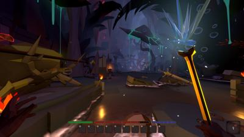](img/2025_dec/ardenfall/20251207143846_1.jpg)
[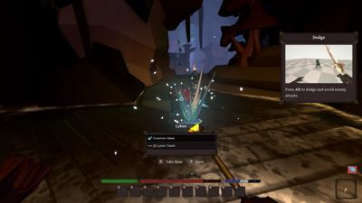](img/2025_dec/ardenfall/20251207144021_1.jpg)
[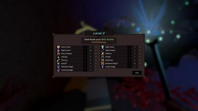](img/2025_dec/ardenfall/20251207145001_1.jpg)
[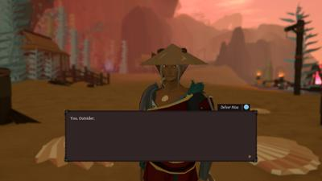](img/2025_dec/ardenfall/20251207145323_1.jpg)
[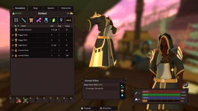](img/2025_dec/ardenfall/20251207145629_1.jpg)
[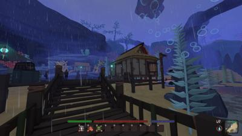](img/2025_dec/ardenfall/20251207150533_1.jpg)
[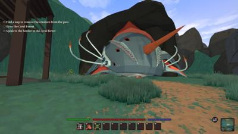](img/2025_dec/ardenfall/20251207151057_1.jpg)
[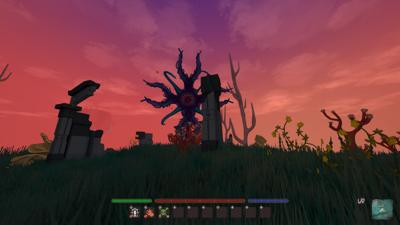](img/2025_dec/ardenfall/20251207151427_1.jpg)
[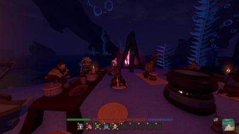](img/2025_dec/ardenfall/20251207151702_1.jpg)
[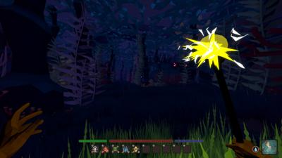](img/2025_dec/ardenfall/20251207151753_1.jpg)
[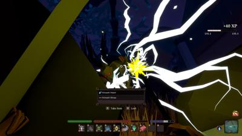](img/2025_dec/ardenfall/20251207152257_1.jpg)
[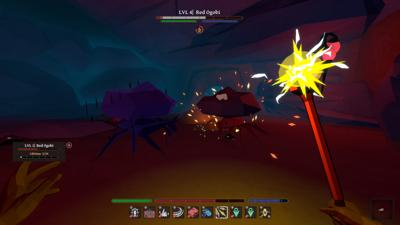](img/2025_dec/ardenfall/20251207153258_1.jpg)

# Queens Domain

- **Steam Page**: [Queens Domain](https://store.steampowered.com/app/1799840/Queens_Domain/)
- **Total Play Time**: 45 minutes
- **Will Purchase**: 
- **Type**: action

> 🕹️ **Description**: Have you heard of king's field.
> 
> 👍👍👍  **Feedback**: `Queens Domain`, a riff on From-Software's `King's Field` is just phenominal. I know I need to play [Lunacid](https://store.steampowered.com/app/1745510/Lunacid/) and the original games. 
> 
> Indie games like this are nailing the dream-like, almost lost-media aesthetic of PS1-era but well beyond what the system could render and draw distance. All while retaining chunky pixels, an almost gameboy on paper sky rendering (that you can turn off by the way for sharp 100% clarity). It's a vibe, and I dig it.
> 
> The combat is pretty simple and punishing. Charge your sword swing to 100% on your stamina bar for one strike, less damage delt if you release early. Slow and metholdical. Strafe ratbugs. Walk back from chickets. Wait to get a blunt weapon for skeletons. The 3 recharging daggers give you a quick out for finishing enemies or baiting one from a pack. Or killing laser flowers high up in trees. 
> 
> The level design even does the dark-souls, loop back to the beginning thing. And I could see 3 areas I wanted to get to but I didn't have the "flying sword" yet. 
> 
> This demo is so much fun.

[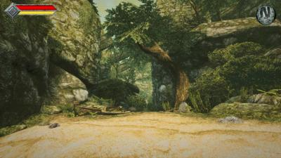](img/2025_dec/queens_domain/20251207132531_1.jpg)
[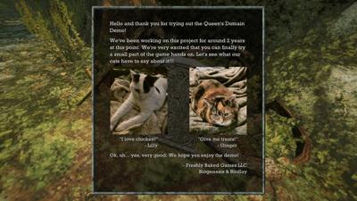](img/2025_dec/queens_domain/20251207132551_1.jpg)
[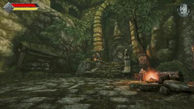](img/2025_dec/queens_domain/20251207132642_1.jpg)
[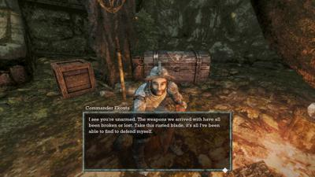](img/2025_dec/queens_domain/20251207132708_1.jpg)
[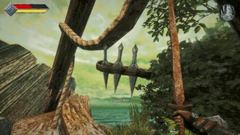](img/2025_dec/queens_domain/20251207133327_1.jpg)
[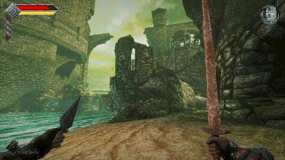](img/2025_dec/queens_domain/20251207133515_1.jpg)
[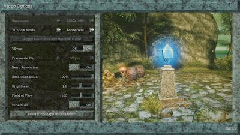](img/2025_dec/queens_domain/20251207134828_1.jpg)
[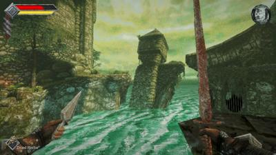](img/2025_dec/queens_domain/20251207135048_1.jpg)
[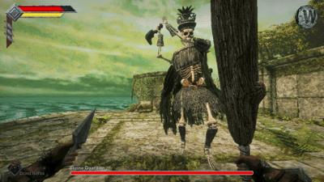](img/2025_dec/queens_domain/20251207140553_1.jpg)
[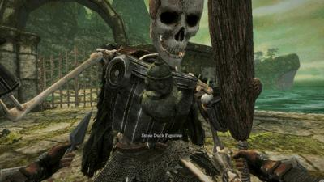](img/2025_dec/queens_domain/20251207140803_1.jpg)
[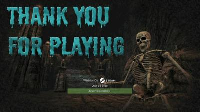](img/2025_dec/queens_domain/20251207140954_1.jpg)
