# nextfest June 2025
## summary

| Game Title                                                                          | Total Play Time | Will Purchase | Type                                        |
|-------------------------------------------------------------------------------------|-----------------|---------------|---------------------------------------------|
| [Stellar Blade Demo](#stellar-blade-demo)                                           | 78 minutes      |               | action                                      |
| [Mina the Hollower Demo](#mina-the-hollower-demo)                                   | 46 minutes      |               | action                                      |
| [Dispatch Demo](#dispatch-demo)                                                     | 30 minutes      |               | story                                       |

# Dispatch Demo

- **Steam Page**: [Dispatch Demo](https://store.steampowered.com/app/3674060/Dispatch_Demo/)
- **Total Play Time**: 30 minutes
- **Will Purchase**: Yep
- **Type**: story

> 🕹️ **Description**: You work a desk job dispatching superheroes
> 
> 👍  **Feedback**: Yeah - very funny. Barely anyone gets along. You screw up most of your dispatches. Nobody respects you because you're an ex-hero who just had a power-suit that broke. They're all taking bets on when you'll quit.
> 
> The gameplay isn't complicated, just clicking on events and trying to pair up who isn't busy. There's a stat "star" and it's a dice roll if you're within the particuarly needed stat. As the heroes upgrade a particular stat, that roll will be easier. The "roll" might be between a few stats though. But you're not here for the gameplay, you're here for the story. And it's looking great. 

[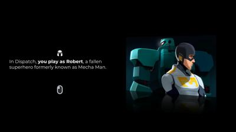](img/2025_june/20250615221247_1.jpg)
[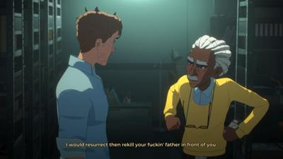](img/2025_june/20250615221844_1.jpg)
[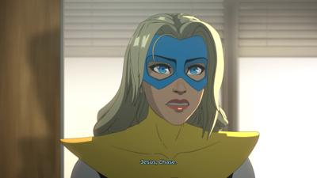](img/2025_june/20250615221849_1.jpg)
[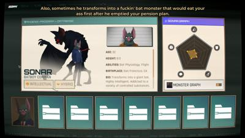](img/2025_june/20250615221945_1.jpg)
[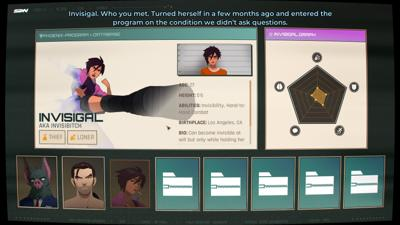](img/2025_june/20250615222009_1.jpg)
[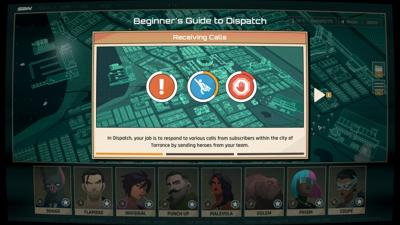](img/2025_june/20250615222352_1.jpg)
[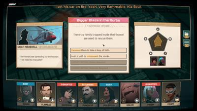](img/2025_june/20250615223445_1.jpg)

[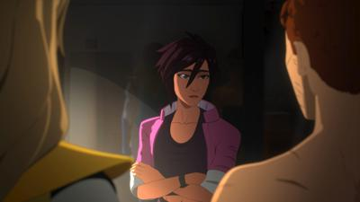](img/2025_june/20250615223723_1.jpg)
[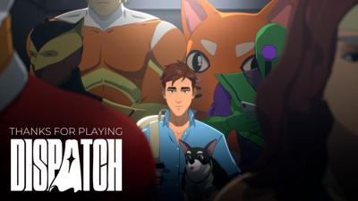](img/2025_june/20250615223858_1.jpg)

# Mina the Hollower Demo

- **Steam Page**: [Mina the Hollower Demo](https://store.steampowered.com/app/3741460/Mina_the_Hollower_Demo/)
- **Total Play Time**: 46 minutes
- **Will Purchase**: Yep
- **Type**: action

> 🕹️ **Description**: Zelda Oracle of Ages/Seasons graphics, bloodborne world, fast action combat
> 
> 👍  **Feedback**: Pretty wild to see modernly fast action gameplay in a gameboy color aethestic. Pretty fun. Just hard enough to make me want to give up but then beat a boss
> 
> You can dig underground and pop up for attacks as a "hollower" like whatever mouse thing you are, it's pretty fun.

[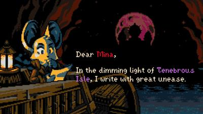](img/2025_june/20250615192003_1.jpg)
[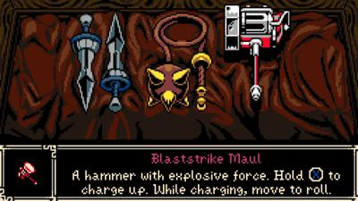](img/2025_june/20250615211957_1.jpg)
[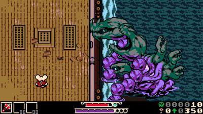](img/2025_june/20250615212116_1.jpg)
[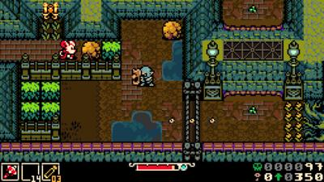](img/2025_june/20250615212419_1.jpg)
[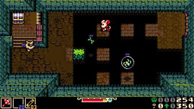](img/2025_june/20250615213029_1.jpg)
[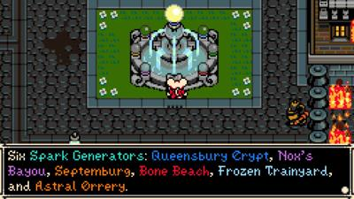](img/2025_june/20250615215440_1.jpg)
[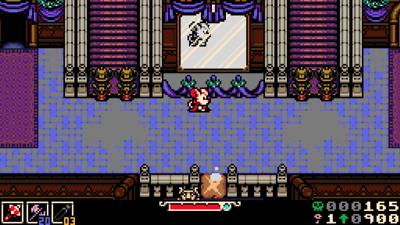](img/2025_june/20250615215728_1.jpg)
[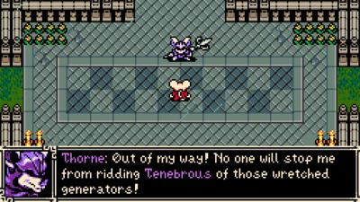](img/2025_june/20250615220037_1.jpg)
[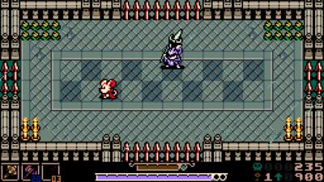](img/2025_june/20250615220053_1.jpg)
[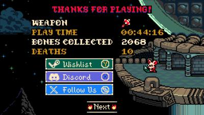](img/2025_june/20250615220309_1.jpg)

# Stellar Blade Demo

- **Steam Page**: [Stellar Blade Demo](https://store.steampowered.com/app/3564860/Stellar_Blade_Demo/)
- **Total Play Time**: 78 minutes
- **Will Purchase**: Yep
- **Type**: action

> 🕹️ **Description**: Action
> 
> 👍 **Feedback**: I like Nier. I like Astral Blade. This is pretty easy - I like Stellar Blade. 

<iframe width="560" height="315" src="https://www.youtube.com/embed/zMCU1mS8ocI?si=40dO5S7Zg4FW8mUv" title="YouTube video player" frameborder="0" allow="accelerometer; autoplay; clipboard-write; encrypted-media; gyroscope; picture-in-picture; web-share" referrerpolicy="strict-origin-when-cross-origin" allowfullscreen></iframe>
