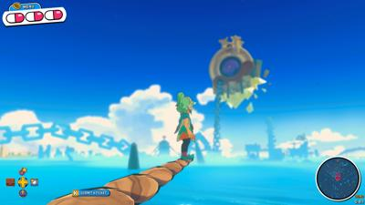
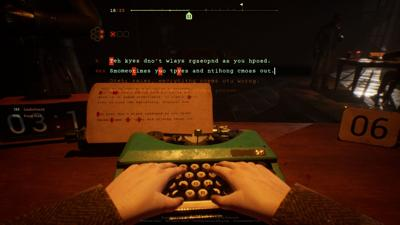
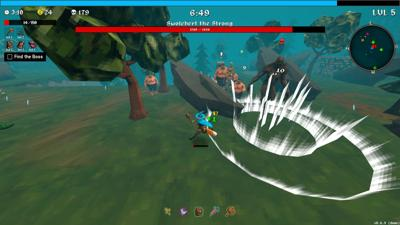
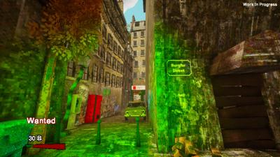
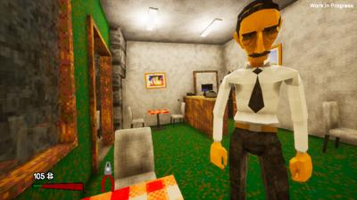
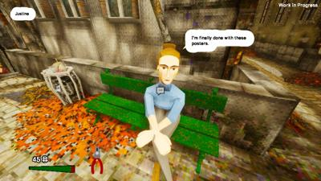
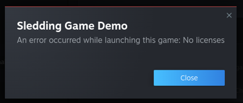
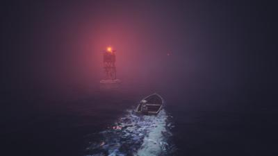
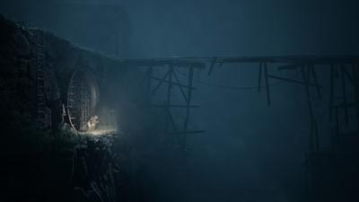

# nextfest October 2025
## summary

| Game Title                                                                          | Total Play Time | Will Purchase | Type                                        |
|-------------------------------------------------------------------------------------|-----------------|---------------|---------------------------------------------|
| [Demon Tides Demo](#demon-tides-demo)                     | 112 minutes     | YES           | platformer                                  |
| [Beyond the Doors](#beyond-the-doors)                     | 89 minutes      |               | horror,mystery                              |
| [Final Sentence Demo](#final-sentence-demo)               | 65 minutes      | lol           | battle-royale,multiplayer,horror            |
| [Odd Town](#odd-town)                                     | 48 minutes      | Probably      | simulation                                  |
| [Skate Story](#skate-story)                               | 48 minutes      |               | skateboarding                               |
| [No Players Online](#no-players-online)                   | 47 minutes      |               | horror                                      |
| [Heaven Does Not Respond](#heaven-does-not-respond)       | 41 minutes      |               | horror                                      |
| [Homura Hime](#homura-hime)                             | 37 minutes      | Maaaaybe           | action                                      |
| [House of Necrosis Demo](#house-of-necrosis-demo)         | 36 minutes      | Yes-leaning   | tactics, horror                             |
| [Mr Sleepy Man](#mr-sleepy-man)                           | 34 minutes      |               | platformer                                  |
| [MOTORSLICE](#motorslice)                                 | 33 minutes      | YES           | action                                      |
| [Neon Divide](#neon-divide)                               | 31 minutes      |               | gacha                                       |
| [REANIMAL](#reanimal)                                     | 30 minutes      | YES           | horror                                      |
| [Painkiller](#painkiller)                                 | 27 minutes      |               | fps,multiplayer                             |
| [Primal Echo Demo](#primal-echo-demo)                     | 26 minutes      |               | platformer                                  |
| [Crisol Theater of Idols Demo](#crisol-theater-of-idols-demo)| 19 minutes      |               | fps, horror                                 |
| [Long Drive North: Co-Op RV Simulator Demo](#long-drive-north-co-op-rv-simulator-demo)      | 15 minutes      |               | survival                                    |
| [Vital Shell Demo Disc](#vital-shell-demo-disc)           | 13 minutes      |               | survivors                                   |
| [Spilled](#spilled)                                       | 12 minutes      |               | cozy                                        |                   |
| [Carnival Hunt](#carnival-hunt)                           | 11 minutes      |               | horror, multiplayer                         |
| [Megabonk](#megabonk)                                     | 10 minutes      |               | survivors                                   |
| [Sledding Game](#sledding-game)                           | 0 minutes       |               | horror                                      |

# Primal Echo Demo

- **Steam Page**: [Primal Echo Demo](https://store.steampowered.com/app/4060770/Primal_Echo_Demo/)
- **Total Play Time**: 26 minutes
- **Will Purchase**: 
- **Type**: platformer

> 🕹️ **Description**: Climb the dystopian future
> 
> 👍  **Feedback**: I haven't played [Lorn's Lure](https://store.steampowered.com/app/1417930/Lorns_Lure/) (ah shit there's a demo) - but climbing giant dystopic, metalltic structures has been on my radar in a sort of opposite of [Peak](https://store.steampowered.com/app/3527290/PEAK/).
> 
> I believe you're born from a mushroom.. like a human construct of what a mushroom thinks a human was like. There's some fruit and birds and "primal" things, but you're traversing an endless metal structures. Very dyson-sphere [Blame! (manga)](https://duckduckgo.com/?t=ffab&q=blame+manga&ia=images&iax=images) vibes. 
> 
> The controls are.. weird, but I kinda get what the 3 indie devs were going for. They're not intuitive but they work. I like how you can die but mostly the mushroom saves you from falls into the void. Doesn't save you falling to the floor I think, but you just revive.. er.. reconstruct?
> 
> I kinda dig it. Unpolished but in a way that makes movement skill based rather than forgiving. 
> 
> I did that it's clearly a metroidvania. There were MANY sprawling pathways that were "OUT OF DEMO" bounds and that was cool. I wound back at the beginning (secret passage) and quit cause I wasn't sure where to go next. 

# Beyond the Doors

- **Steam Page**: [Beyond the Doors](https://store.steampowered.com/app/2714150/Beyond_the_Doors/)
- **Total Play Time**: 89 minutes
- **Will Purchase**: 
- **Type**: horror,mystery

> 🕹️ **Description**: ok wtf is behind these doors
> 
> 👍  **Feedback**: First off - I kept crashing the game on day 2 (out of 5) but liked it enough to try to [reach out to the dev](https://steamcommunity.com/app/2714150/discussions/0/500587419683617513/) for support. Running WIP things in linux is suprising it works this well tbh.
> 
> I'm not sure what this game is. I'm in a garbage filled mystery "apartment" building surviving on cheeseburgers and soda. I'm not sure the real world exists outside this building. I'm not sure anyone lives here.
> 
> What I'm doing is getting emails for recordings and I have to physically wire receivers from my basement dwelling to the top floors and record. And seeing how my computer is ONCE AGAIN FROM THE NINTIES IF NOT EARLIER - it takes forever. I could upgrade shit if I could afford it from the money I get from these recordings.
> 
> So far..... the ghosts or whatever are banging and I did get one creepy child laugh for a second. 
> 
> Whatever I'm doing is really f-ing wrong. 
> 
> ...... this demo was so intruiging in that its entire premise is a mystery. Literally the screenshots brought me in and I didn't even read the description. 

# Skate Story

- **Steam Page**: [Skate Story](https://store.steampowered.com/app/1263240/Skate_Story/)
- **Total Play Time**: 48 minutes
- **Will Purchase**: 
- **Type**: skateboarding

> 🕹️ **Description**: I too would sign a demonic contract to be made of glass if it were the only way I could skateboard. 
> 
> 👍👍👍  **Feedback**: *heavy breathing*
>  
> Somehow not only is this the a realistic skateboarding game, it's.. philosophical?
> 
> I think you're dead (might have missed something) - but you can skate if you're under contract and turned to glass. Your quest is to eat the moon. It makes more sense than I'm going to try to explain. You wind up battling a philosopher to see the beauty in your skateboarding quest.
> 
> The music is phenomenal, gameplay, atmosphere - everything. So so great. 

# Demon Tides Demo

- **Steam Page**: [Demon Tides Demo](https://store.steampowered.com/app/3477260/Demon_Tides_Demo/)
- **Total Play Time**: 112 minutes
- **Will Purchase**: YES
- **Type**: platformer

> 🕹️ **Description**: FANTASTIC PLATFORMER
> 
> 👍👍👍  **Feedback**: I knew of the platformer `Demon Turf` but hadn't played it. That'll change. This is the sequel `Demon Tides` now with 3D character models instead of sprites.
> 
> This game excells in so many things. We're talking rivaling mario here. When you jump, you basically have a double jump + bat glide - it's very long but the jumps are spaced out long too. To get around the world fast, your snake form just f-ing zooms across land and water.
> 
> I love that you can put a checkpoint flag anywhere and warp back. If you get stuck on a particular hard area, you don't have to repeat it. 
> 
> I love how the world is windwaker-open-world with islands akin to Mario Bowser's Fury. 
> 
> This is really, REALLY good. 

# Mr Sleepy Man

- **Steam Page**: [Mr Sleepy Man](https://store.steampowered.com/app/1657740/Mr_Sleepy_Man/)
- **Total Play Time**: 34 minutes
- **Will Purchase**: 
- **Type**: platformer

> 🕹️ **Description**: silly platformer
> 
> 👎  **Feedback**: unfortunately a dud for me. A silly little indie platformer and good use of music - but didn't hold a candle to last year's `Orbos Exodus` and I just wanted to play `Mario Sunshine` or a demo I hadn't tried yet `Demon Tides`

# No Players Online

- **Steam Page**: [No Players Online](https://store.steampowered.com/app/2701800/No_Players_Online/)
- **Total Play Time**: 47 minutes
- **Will Purchase**: 
- **Type**: horror

> 🕹️ **Description**: More creepypasta PC
> 
> 🫳  **Feedback**: Pretty similar to [Heaven does not respond](#heaven-does-not-respond) in that this is a haunted PC where no one is online and you're downloading random crappy games from a dead forum. Only difference is there's a soul transfer program and seems to be someone trapped in a capture-the-flag game. I was able to combine two unrelated games, a cracked visual novel of a college student and "fishing with knives II" to make a game that had me walking a dog until the game broke. Or I got eaten.
> 
> It's kinda neat and creepy but arbitrarily guessing the next combination the game wanted me to do (I guess glowing means something) - I got stuck. It's possibly non-linear which makes it more like a puzzle - just a puzzle I'm not sure I have patience beyond this. 

# Painkiller

- **Steam Page**: [Painkiller](https://store.steampowered.com/app/2300120/Painkiller/)
- **Total Play Time**: 27 minutes
- **Will Purchase**: 
- **Type**: fps,multiplayer

> 🕹️ **Description**: mid co-op
> 
> 👎  **Feedback**: You kill demons in pergatory. I was pretty bored actually I think cause it just puts you in a room and kill everything that spawns in until the door opens. It's multiplayer focused, so offline the 2 bots do everything. I couldn't see what was going on half the time. It tries to be Vermintide or co-op doom. Meh

# Final Sentence Demo

- **Steam Page**: [Final Sentence Demo](https://store.steampowered.com/app/4021860/Final_Sentence_Demo/)
- **Total Play Time**: 6 minutes
- **Will Purchase**: lol
- **Type**: battle-royale,multiplayer,horrow

> 🕹️ **Description**: Typing battle-royale
> 
> 👍👍  **Feedback**: Christ this is a fucked up game - that I'm really good at.
> 
> My average words-per-minute is consistently 75-80 WPM but accuracy 98%. My heart rate 100. I HAVE A 1/3 CHANCES OF WINNING ANY ROUND - which is insane for a 40 player battle royale-game. I won multiple times.
> 
> But I make a lot of dyslexic mistakes, and those reset the line. and 3 of those puts a bullet in the gun of russian-roulette. I literally think this game helps my dyslexia typing - I am not even joking. It's like I know see how speaking is going to come out spaeking with my fingers. 
> 
> What's fucked up (aside from the imagry) is there was one of those jumbled sentences with a lot of mistakes, and I could type it "correctly" but the game makes you type it incorrectly - which I could not due. Dude won it at 66 WPM. 
> 
> A lot fo `Scheiße` in voice chat.
> 
> Millenials have an unfair advantage in this game, I AM CERTAIN. 

# Neon Divide

- **Steam Page**: [Neon Divide](https://store.steampowered.com/app/3887650/Neon_Divide/)
- **Total Play Time**: 31 minutes
- **Will Purchase**: 
- **Type**: gacha

> 🕹️ **Description**: Gacha - as in, ha gacha to play this stupid game
> 
> 👎  **Feedback**: Pretty garbage
> 
> Mobile port, you just tap J to win. Actually I got confused on a fight not ending cause I realized I was infinitely comboing the enemy. So I went to 1000x combo. I could have quit then. I watched some more missions.
> 
> It's the type of game that has currency associated to "play next level". Utter trash
> 
> I wish it had the gameplay of the last game [Homura Hime](#homura-hime) cause the space/future setting was neat. 

# Homura Hime

- **Steam Page**: [Homura Hime](https://store.steampowered.com/app/3201470)
- **Total Play Time**: 37 minutes
- **Will Purchase**: Maaaaybe
- **Type**: action

> 🕹️ **Description**: Anime nier-adjacent
> 
> 🫳  **Feedback**: 
> 
> Pros: Nier-style gameplay, fun boss fights. Good move-set and parry system. I liked a special that let me ninja zoom across the arena to a boss fight. Nier should add the naruto run
> 
> Cons: If you took out the cool world design of Nier, you'd have an.. "ok" game. The story is basic. "Demons take over humans sometimes". The levels were linear yet I had a guide I didn't need. I could span the parry button without consequence, so timing mattered less than it should. 
> 
> But it was fun enough that I did the boss fight multiple times.

# House of Necrosis Demo

- **Steam Page**: [House of Necrosis Demo](https://store.steampowered.com/app/3447260/House_of_Necrosis_Demo/)
- **Total Play Time**: 36 minutes
- **Will Purchase**: 
- **Type**: tactics, horror

> 🕹️ **Description**: Resident Evil with a twist
> 
> 👍 **Feedback**: Did I just write down "tactics, horror"
> 
> Whoa. Ok before playing, I thought looked too derivative. But that's like thinking `Half-life` and `Abiotic Horror` play the same, when one is a first-person-shooter and the second a survival game.
> 
> `House of Necrosis` is a mystery-dungeon tactics game. Meaning when you move or take a turn, so do all characters. Don't move? World is paused. Being able to look in 3D (straight ahead), aim and shoot 3 spaces away, and use a knife in front - felt really great actually. Some enemies (if you're not swamped) have patters, like `Crypt of the Necrodancer` minus the musical timing. That means if you have an empty room, you can dodge/attack at the right time and take no damage taking them out. 
> 
> The healing spell is straight up `Final Fantasy 7` Aerith healing spell. You can identify serums, use them to warp or petrify (throw) at enemies. 
> 
> The boss was hard, I warped out (item). 

# Megabonk

- **Steam Page**: [Megabonk](https://store.steampowered.com/app/3405340/Megabonk/)
- **Total Play Time**: 10 minutes
- **Will Purchase**: 
- **Type**: survivors

> 🕹️ **Description**: 3D vampire survivors
> 
> 👍  **Feedback**: Yeah I can see why this is popular - it's vampire survivors but 3D. And it does the chest/loot addictive stuff I noticed the last one was missing. MEGABONK does have one interesting mechanic the "bonk"... basicaly some enemies explode and it can fling you across the map. And that can be to your advantage (or not). 

# Vital Shell Demo Disc

- **Steam Page**: [Vital Shell Demo Disc](https://store.steampowered.com/app/3928280/Vital_Shell_Demo_Disc/)
- **Total Play Time**: 13 minutes
- **Will Purchase**: 
- **Type**: survivors

> 🕹️ **Description**: PS1-style Mech survivors game
> 
> 🫳  **Feedback**: Love the PS1 aesthetic and that you can aim with the 2nd analog stick. Area is small, flat like Brotato. It's ok, good for what it does. 
> 
> oh shit, I should install MEGABONK.

# Crisol Theater of Idols Demo

- **Steam Page**: [Crisol Theater of Idols Demo](https://store.steampowered.com/app/3989380/Crisol_Theater_of_Idols_Demo/)
- **Total Play Time**: 19 minutes
- **Will Purchase**: 
- **Type**: fps, horror

> 🕹️ **Description**: FPS slow vampire
> 
> 👎  **Feedback**: This game was slow and dull. It felt like the ethestic was sorta trying to be bioshock, hide from the big daddy. You reload your gun with blood which drains your health. Demo felt "we're working on the big baddie ai, so here's a little town loop. It just wasn't good gunplay? 
> 
> I'd much rather play `Witchfire`.

# Odd Town

- **Steam Page**: [Odd Town](https://store.steampowered.com/app/2688780/Odd_Town/)
- **Total Play Time**: 48 minutes
- **Will Purchase**: Probably
- **Type**: simulation

> 🕹️ **Description**: A quiet French retreat.
> 
> 👍  **Feedback**: My car broke down in near a quiet little French town. The mechanic won't give it back without $300. Ignoring the pile of cars blocking the exit of the town, I answer a payphone and get entangled in a wee bit entangled with a local conspiracy theorist. I get jailed for stealing a sandwich, I help a lady figure out why her missing person posters are getting ripped down (after beating the guy up). I fail at selling drugs (apparently "Hello fellow narcatics enjoyer" is a cop, who knew). 
> 
> There's a simple level of simulation going on with people's patterns - nothing complex. You can juggle money, health (eat food) - lose "wanted" status by changing clothes - and only so many times you can break out of jail before the brick up the holes in the wall. Game seems like a silly, fun little mystery romp. 

# MOTORSLICE

- **Steam Page**: [MOTORSLICE](https://store.steampowered.com/app/2830030/MOTORSLICE/)
- **Total Play Time**: 33 minutes
- **Will Purchase**: YES
- **Type**: action

> 🕹️ **Description**: Just a girl in a dystopia making a living with your chainsaw
> 
> 👍👍👍 **Feedback**: I've followed the dev on this one. This is the winner, handsdown. The platforming is slick. The chainsaw is used on yellow walls for "infinite" wall running (up too!), combined with shorter wall running and jumping. The combat is one hit kills. The bosses are metal shadow-of-colossus. This is just fantastic.

# Carnival Hunt

- **Steam Page**: [Carnival Hunt](https://store.steampowered.com/app/1181550/Carnival_Hunt/)
- **Total Play Time**: 11 minutes
- **Will Purchase**: 
- **Type**: horror, multiplayer

> 🕹️ **Description**: 4v1 multiplayer
> 
> 👎  **Feedback**: Clockwork bunnies with that need to be wound up to move from teammates to against a clockwork magician to open doors and progress to the top floor. Not really my thing.

# Heaven Does Not Respond

- **Steam Page**: [Heaven Does Not Respond](https://store.steampowered.com/app/3817240/Heaven_Does_Not_Respond/)
- **Total Play Time**: 41 minutes
- **Will Purchase**: 
- **Type**: horror

> 🕹️ **Description**: 100% accurate windows ME simulation
> 
> 👍  **Feedback**:  hm. I think this dead guy's computer is hacked. I reset the router and kept running random executables I got from AIM, it's probably not that. 

# Sledding Game

- **Steam Page**: [Sledding Game](https://store.steampowered.com/app/3438850/Sledding_Game/)
- **Total Play Time**: 0 minutes
- **Will Purchase**: 
- **Type**: horror

> 🕹️ **Description**: Didn't launch. I missed the demo from last time. Cleared harddrive space. Probably cool. 0/10.

# Long Drive North: Co-Op RV Simulator Demo

- **Steam Page**: [Long Drive North: Co-Op RV Simulator Demo](https://store.steampowered.com/app/4024830/Long_Drive_North_CoOp_RV_Simulator_Demo/)
- **Total Play Time**: 15 minutes
- **Will Purchase**: 
- **Type**: survival

> 🕹️ Description: RV Survival 
> 
> 👎  Feedback: Nope, awful. Like a shitty Pacific Drive where you repair your RV with convient bunch of dead cars. > > You're trying to survive and stay ahead "of the storm" but the devs didn't account for me getting bored, racing into > the storm to kill myself and falling off the map. Which weirdly put me 4 miles AHEAD of the storm, so I quit.

# Spilled

- **Steam Page**: [Spilled](https://store.steampowered.com/app/2240080/Spilled/)
- **Total Play Time**: 12 minutes
- **Will Purchase**: 
- **Type**: cozy

> 🕹️ **Description**: Clean up the river
> 
> 🫳  **Feedback**: If I was single I'd probably live on a long boat too. I can apprechiate the cozy, relaxed vibe of this game and its pixel graphics. I was bored. If I was in a relaxing mood, cool - it's clearly a passion project.

# REANIMAL

- **Steam Page**: [REANIMAL](https://store.steampowered.com/app/2129530/REANIMAL/)
- **Total Play Time**: 30 minutes
- **Will Purchase**: 
- **Type**: horror

> 🕹️ **Description**: Little nightmares ++> 
> 
> 👍  **Feedback**: GREAT
> When the "escort mission" companion is running faster than you, you're in trouble.
> 
> Donnie: Why do you wear that stupid bunny suit? Frankie: Why do you wear that stupid human suit? - Donnie Darko

