# 2026 June

| Game Title                                                                          | Total Play Time | Will Purchase | Type                                        |
|-------------------------------------------------------------------------------------|-----------------|---------------|---------------------------------------------|
| [4x4 in a Furniture Store](#4x4-in-a-furniture-store)     | 157 minutes     | Yes           | puzzle                                      |
| [Parasite Mutant](#parasite-mutant)                       | 78 minutes      | Yes           | horror, action                              |
| [PRAGMATA SKETCHBOOK - DEMO](#pragmata-sketchbook---demo) | 41 minutes      | Yes           | action                                      |
| [Truck-kun is Supporting Me from Another World?!](#truck-kun-is-supporting-me-from-another-world?!)| 33 minutes      | Maybe         | arcade                                      |
| [Cozy Grove 2](#cozy-grove-2)                             | 31 minutes      | Yes           | cozy                                        |
| [Unending Aqua](#unending-aqua)                           | 30 minutes      | No            | puzzle, horror                              |

# 4x4 in a Furniture Store

- **Steam Page**: [4x4 in a Furniture Store](https://store.steampowered.com/app/4135570/4x4_in_a_Furniture_Store/)
- **Total Play Time**: 157 minutes
- **Will Purchase**: Yes
- **Type**: puzzle

> 🕹️ **Description**: A traditional game
> 
> 👍  **Feedback**: Yeah this was the right amount of silly and semi-challenging puzzles that had easy honk to reset. Furnichill radio is great.

[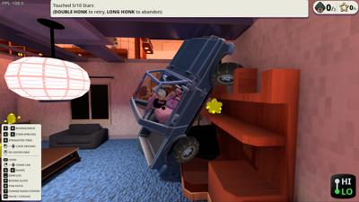](img/2026_june/4x4_in_a_furniture_store/20260613195326_1.jpg)
[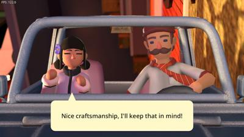](img/2026_june/4x4_in_a_furniture_store/20260613195426_1.jpg)
[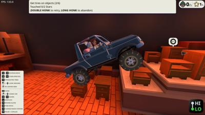](img/2026_june/4x4_in_a_furniture_store/20260613195732_1.jpg)
[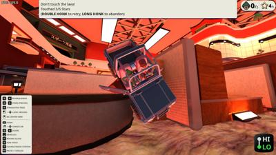](img/2026_june/4x4_in_a_furniture_store/20260613201304_1.jpg)
[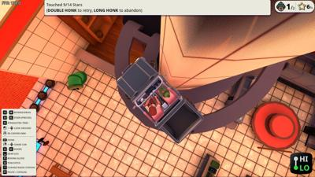](img/2026_june/4x4_in_a_furniture_store/20260613204959_1.jpg)
[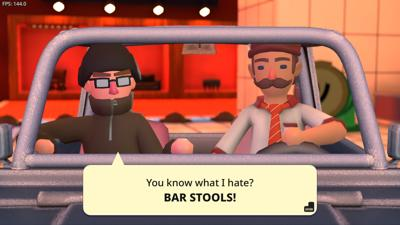](img/2026_june/4x4_in_a_furniture_store/20260613200823_1.jpg)

# Cozy Grove 2

- **Steam Page**: [Cozy Grove 2](https://store.steampowered.com/app/2021960/Cozy_Grove_2/)
- **Total Play Time**: 31 minutes
- **Will Purchase**: Yes
- **Type**: cozy

> 🕹️ **Description**: So glad they left netflix-games
> 
> 👍  **Feedback**: atm is more of the same. but I like cozy grove, so that's great

[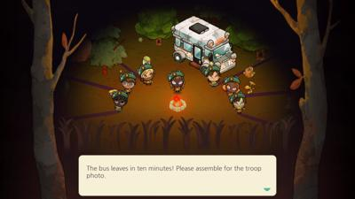](img/2026_june/cozy_grove_2/20260610121226_1.jpg)
[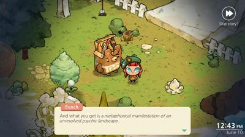](img/2026_june/cozy_grove_2/20260610124304_1.jpg)

# Parasite Mutant

- **Steam Page**: [Parasite Mutant](https://store.steampowered.com/app/3983000/Parasite_Mutant/)
- **Total Play Time**: 78 minutes
- **Will Purchase**: Yes
- **Type**: horror, action

> 🕹️ **Description**: Have you played parasite eve?
> 
> 👍  **Feedback**: Parasite Eve has been on my list to play - this has convinced me it's still on the list.
> 
> I assume the gameplay is the same. You build up 1-2 action bars and can execute a melee sword attack or ranged pistol attack. You hit within a grid, so it's not worth shooting outside the radius . You learn which enemies are good for what type (bug-flying for shooting). You want to time your attack (probably after an enemy attack) because you have a delay after your action. A bit late I realized a third option for items and a magic-cannon (with basically mana potions.. er ESP?). I died at the boss final phase, so the second time I went with mostly ranged attacks until phase 2 I went balancing cannon and healing.
> 
> An early boss, I realized I could avoid lazers by standing behind a fountain in the middle of the screen.
> 
> One of the puzzles was annoying obtuse but I think only because the "PRESS TO INTERACT" wasn't wide enough for I thought I was facing the thing. And if you're going to do not-tank controls, it needs to hold longer between camera changes cause I kept flipping between cameras (broke the game once).
> 
> Overall I think it's great, such a good indie game and combat system.

[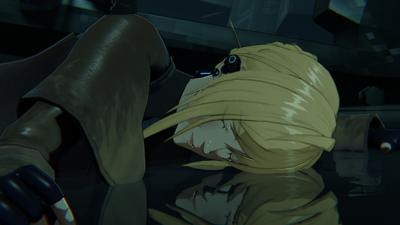](img/2026_june/parasite_mutant/20260615201646_1.jpg)
[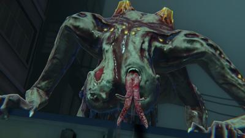](img/2026_june/parasite_mutant/20260615201817_1.jpg)
[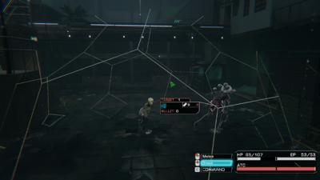](img/2026_june/parasite_mutant/20260615202137_1.jpg)
[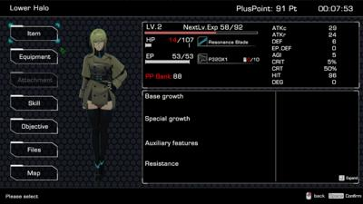](img/2026_june/parasite_mutant/20260615202347_1.jpg)
[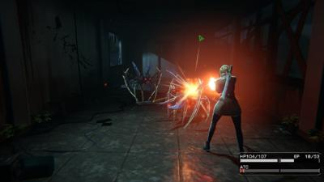](img/2026_june/parasite_mutant/20260615202534_1.jpg)
[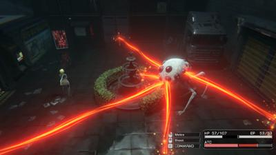](img/2026_june/parasite_mutant/20260615202918_1.jpg)
[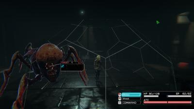](img/2026_june/parasite_mutant/20260615211203_1.jpg)
[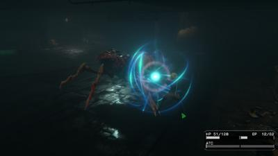](img/2026_june/parasite_mutant/20260615211548_1.jpg)
[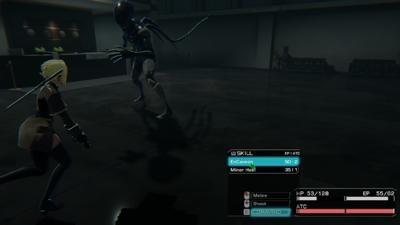](img/2026_june/parasite_mutant/20260615212327_1.jpg)
[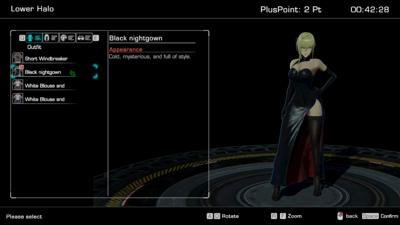](img/2026_june/parasite_mutant/20260615213139_1.jpg)

# **PRAGMATA SKETCHBOOK - DEMO**

- **Steam Page**: [PRAGMATA SKETCHBOOK - DEMO](https://store.steampowered.com/app/3357650/PRAGMATA_SKETCHBOOK_DEMO/)
- **Total Play Time**: 41 minutes
- **Will Purchase**: Yes
- **Type**: action

> 🕹️ **Description**: You can't convince me this isn't Megaman x Deadspace
> 
> 👍  **Feedback**: Hey I played this in April, but yanked the screenshots off my steamdeck just for you. I usually know if I'm into a demo before I play it. Maybe cause this is a full priced game - this did get me to go from simply knowing of the game to all-in.
> 
> I really liked the combat and hacking enemies with the mini-game on the dpad while in combat. And it ran great on the steam deck. Very fun.

[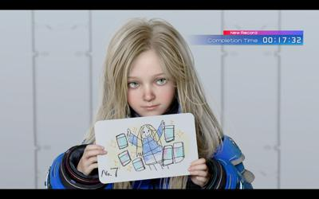](img/2026_june/pragmata_sketchbook_demo/20260429222427_1.jpg)
[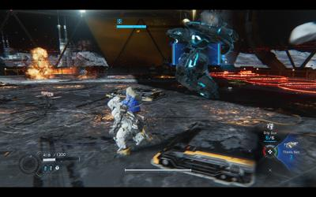](img/2026_june/pragmata_sketchbook_demo/20260429222209_1.jpg)
[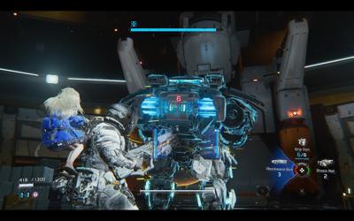](img/2026_june/pragmata_sketchbook_demo/20260429222007_1.jpg)
[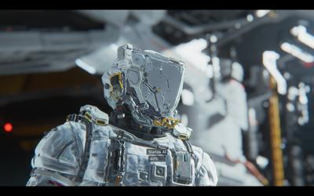](img/2026_june/pragmata_sketchbook_demo/20260429221906_1.jpg)
[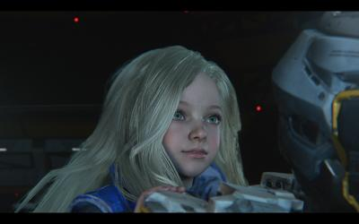](img/2026_june/pragmata_sketchbook_demo/20260429221833_1.jpg)
[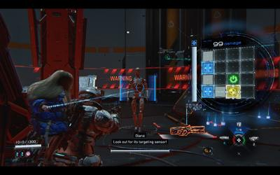](img/2026_june/pragmata_sketchbook_demo/20260429221725_1.jpg)
[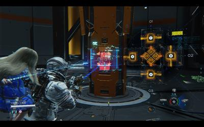](img/2026_june/pragmata_sketchbook_demo/20260429221642_1.jpg)
[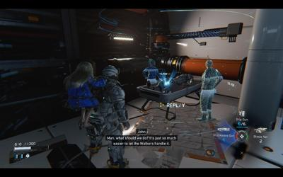](img/2026_june/pragmata_sketchbook_demo/20260429221326_1.jpg)
[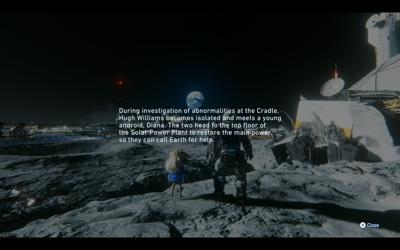](img/2026_june/pragmata_sketchbook_demo/20260429220007_1.jpg)
[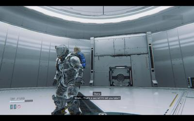](img/2026_june/pragmata_sketchbook_demo/20260429215959_1.jpg)

# **Unending Aqua**

- **Steam Page**: [Unending Aqua](https://store.steampowered.com/app/3704540/Unending_Aqua/)
- **Total Play Time**: 30 minutes
- **Will Purchase**: No
- **Type**: puzzle, horror

> 🕹️ **Description**: Backrooms pool edition, but not "pools"
> 
> 🫱  **Feedback**: Yeah I played pools too. Start in a weird hotel, do little puzzles with keycards to go into the employee area. I liked the little duck collectibles. 'Pools' had more surreal geometry, this one is probably a slow burn. Dodge mutant fish. It was kinda meh.
> 
> It has a lot more slides to ride tho.

[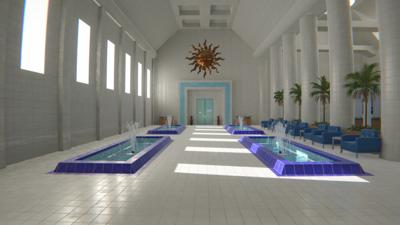](img/2026_june/unending_aqua/20260620161836_1.jpg)
[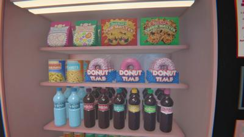](img/2026_june/unending_aqua/20260620161941_1.jpg)
[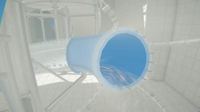](img/2026_june/unending_aqua/20260620162244_1.jpg)
[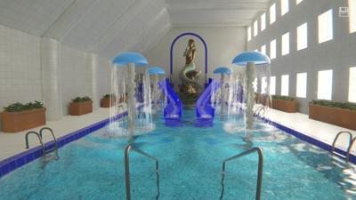](img/2026_june/unending_aqua/20260620162419_1.jpg)
[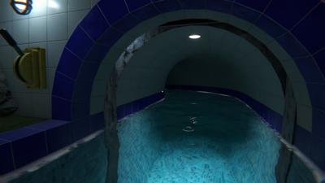](img/2026_june/unending_aqua/20260620162824_1.jpg)
[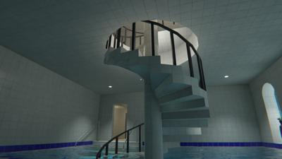](img/2026_june/unending_aqua/20260620162832_1.jpg)
[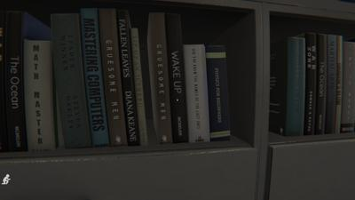](img/2026_june/unending_aqua/20260620163003_1.jpg)
[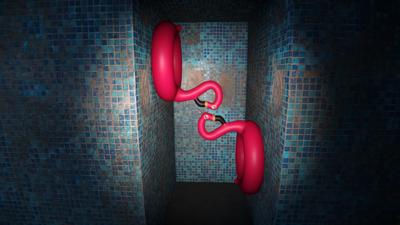](img/2026_june/unending_aqua/20260620164333_1.jpg)
[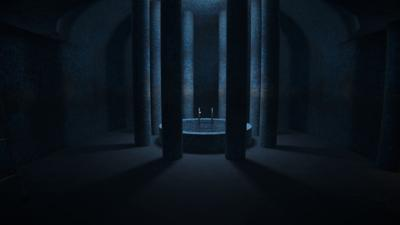](img/2026_june/unending_aqua/20260620164341_1.jpg)
[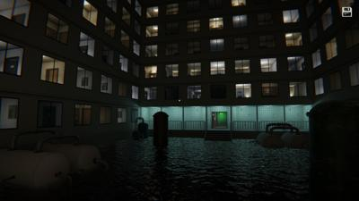](img/2026_june/unending_aqua/20260620164412_1.jpg)

# **Truck-kun is Supporting Me from Another World?!**

- **Steam Page**: [Truck-kun is Supporting Me from Another World?!](https://store.steampowered.com/app/3642010/Truck_kun_is_Supporting_Me_from_Another_World/)
- **Total Play Time**: 33 minutes
- **Will Purchase**: Maybe
- **Type**: arcade

> 🕹️ **Description**: Isekai'd the whole town
> 
> 👍  **Feedback**: You isekai'd it some girl with your truck, but now.. apparently.. if isekai more people into mobs and hit more items into XP(?) she'll level up and be able to return. Maybe if she's isekai-ing the mobs with her sword, they come back?
> 
> You have to honk to let get her to attack. You have a side-hit to take out police. You can 180 reverse and boost. It's pretty fun. The game is crazy taxi if it were genocidal.
> 
> It does kinda feel like 5 minutes is the whole game..

[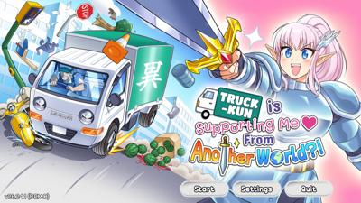](img/2026_june/truck_kun_is_supporting_me_from_another_world/20260620165438_1.jpg)
[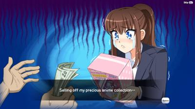](img/2026_june/truck_kun_is_supporting_me_from_another_world/20260620165459_1.jpg)
[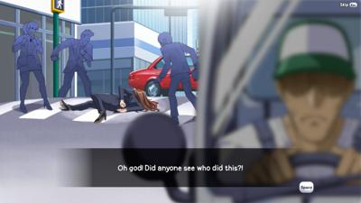](img/2026_june/truck_kun_is_supporting_me_from_another_world/20260620165521_1.jpg)
[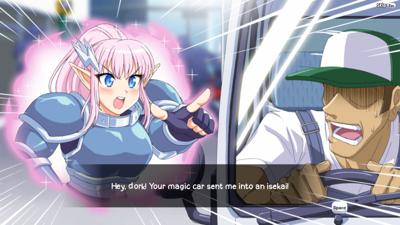](img/2026_june/truck_kun_is_supporting_me_from_another_world/20260620165536_1.jpg)
[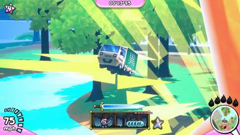](img/2026_june/truck_kun_is_supporting_me_from_another_world/20260620170002_1.jpg)
[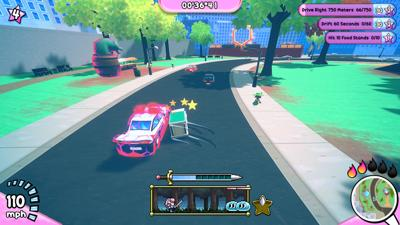](img/2026_june/truck_kun_is_supporting_me_from_another_world/20260620170346_1.jpg)
[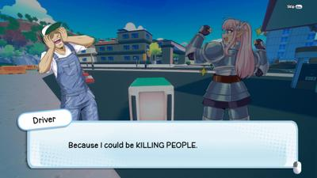](img/2026_june/truck_kun_is_supporting_me_from_another_world/20260620170506_1.jpg)
[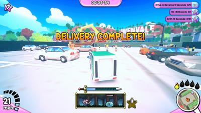](img/2026_june/truck_kun_is_supporting_me_from_another_world/20260620171311_1.jpg)
[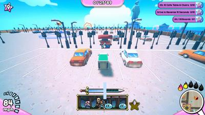](img/2026_june/truck_kun_is_supporting_me_from_another_world/20260620172334_1.jpg)
[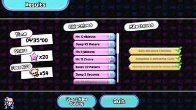](img/2026_june/truck_kun_is_supporting_me_from_another_world/20260620172736_1.jpg)
