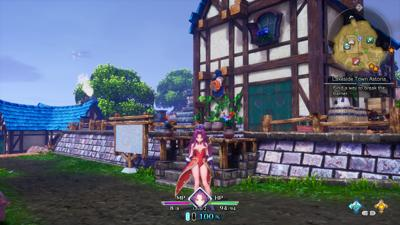

# Talos Principle 2
Verdict: Love love love 👍

I skipped the demo for the actual game is how much I love this series. :)

[https://store.steampowered.com/app/835960/The_Talos_Principle_2/](https://store.steampowered.com/app/835960/The_Talos_Principle_2/)

# Empty Shell Prologue
Verdict: Liked 👍

And like... I don't get it because this game is violent but I liked it. Maybe it's just shooting alien bugs that's fine. This one is survival rogue-like, weird 1950s story, weird turn on generates and do objectives and escape and you dont' have enough bullets to survive. I got crushed multiple times then one time I just concerved ammo right, set down a turret at the right time and survived. I like the loop and map and aestetic 

[https://store.steampowered.com/app/2224850/EMPTY_SHELL_PROLOGUE/](https://store.steampowered.com/app/2224850/EMPTY_SHELL_PROLOGUE/ "https://store.steampowered.com/app/2224850/EMPTY_SHELL_PROLOGUE/")

https://store.steampowered.com/app/2243110/EMPTY_SHELL/

# Laika 👎
Verdict: MIXED - mostly 👎 I wanted to like this, it's basically line rider on a motorcycle with guns, but I found its violence off-putting. Which is bizzarre cause it's not like I don't play violent games, but something about cartoon dogs and violence is the CENTRAL plot that actually made me not want to play it more. Which it's fairly fun and unique in movement - but I didn't want to play more 

[https://store.steampowered.com/app/1796220/Laika_Aged_Through_Blood/](https://store.steampowered.com/app/1796220/Laika_Aged_Through_Blood/ "https://store.steampowered.com/app/1796220/Laika_Aged_Through_Blood/") 

# The Thaumaturge 
oh. my. god. I am blown away by **The Thaumaturge** demo. I had no idea what this was going in, didn't even look into it other than it looked spooky. You're some sort of cursed, dying mystic in early 1900s haunted by some sort of grim reaper dude. You use perception abilities to force-memory objects and investigate situations, but you're trying to mostly cure yourself while your undead-ghost-spirit friend is... I'm sure not the most helpful. Combat is turn-based and very tight, like dodge and punch and win. Mr Ghosty is almost like a persona doing death-blows to enemies that can't see him. I image the story-aspects are like Disco Elysium. I'm getting some Sherlock Holmes vibes but better gameplay polish. Also the graphicsare crazy good. I've tracked down Rasputin who is unsure he can help me as I'm way more f-ed up than is within his healing abilities. This game is fucking dope.

[https://store.steampowered.com/app/1684350/The_Thaumaturge/](https://store.steampowered.com/app/1684350/The_Thaumaturge/ "https://store.steampowered.com/app/1684350/The_Thaumaturge/")

# Deep Rock Galactic Survivor 

I really good demo I already played if you like vampire survivors or deep rock 

[https://store.steampowered.com/app/2321470/Deep_Rock_Galactic_Survivor/](https://store.steampowered.com/app/2321470/Deep_Rock_Galactic_Survivor/ "https://store.steampowered.com/app/2321470/Deep_Rock_Galactic_Survivor/")

# Star Ocean: The Second Story R
VERDICT: Too pretty WHERE IS MY XENOGEARS SQUARE.

[https://store.steampowered.com/app/2238900/STAR_OCEAN_THE_SECOND_STORY_R/](https://store.steampowered.com/app/2238900/STAR_OCEAN_THE_SECOND_STORY_R/)

# ANOTHER CRAB'S TREASURE 
VERDICT: The best demo I've ever played. I died in the tutorial a lot. I mean look at this. This is the TUTORIAL: [https://youtu.be/rWDyIRahXYc?si=jUS7kIv1eX2UW4i_](https://youtu.be/rWDyIRahXYc?si=jUS7kIv1eX2UW4i_ "https://youtu.be/rWDyIRahXYc?si=jUS7kIv1eX2UW4i_")
1. _[_6:51 PM_]_
    
    "YOUR SPECIAL ATTACKS ARE CALLED UMAMI ATTACKS AND YOU UPGRADE THEM BY PUTTING POINTS IN THE MSG STAT. I AM DEAD." (edited)
    
2. _[_6:52 PM_]_
    
    "That's it, forget serious games. I'm only playing silly games."
    
3. _[_6:53 PM_]_
    
    "I love that the soda cans are fizzle cans from 'Going Under'."
4. _[_6:53 PM_]_
    "I LOVE that each shell has its own special attack."

Cee feels 😪 _—_ 10/09/2023 6:55 PM
"@Geddy FISHING is a freaking grappling hook for movement and attacks. It's like Sekiro, to be honest."

 

# Jumplight Odyssey

Oh. My. God. This is FTL combined with the Sims or Sim City. This is FTL but the fucking-enterprise and a cew of 100 people are simulted in real-time. You can pause - you have to build power supplies, and starlight (fuel) harvestors, and fix the med-bay that got shot up so people can rest and heal... all while being persued by an alien armada on your heels. There are scientists, engineers (builders), combat, supply (move around goods). You can manage individuals and re-assign and say who leads what. YOU CAN BUILD ENTIRE ROOMS and what's in them and where they go. The build/pause menu has sims-like elevator music. There's a random pig and robot on board. The cutscenes are 80s anime. I love this.

https://store.steampowered.com/app/1893820/Jumplight_Odyssey/

# Alterium Shift 👎
Verdict: 👎
Uhh.. so I picked the mage who kin
da looks like a rich asshole and must be because everyone HATED me. Like literally "my day was going great then you showed up". I'm supposed to study for an exam tomorrow. I just ran away from the town into a dense forest unit I ran out of mana and died. Maybe that's a little too much freedom or just wasn't... fun to play this character trope? Combat was fine. Graphics were fine. I dunno

https://store.steampowered.com/app/1586990/Alterium_Shift/

# Reverse Collapse: Codename Bakery 
Verdict: Will purchase

This demo was literally hours - I think it might have been the full game and no one noticed.

I like this one if not a little mixed. It's tactics, somewhere between fire emblem and xcom. What I like is that you can do multiple actions/movements so long as you use AP points in a limited meter. I also like how stealth is an actual mechanic, where enemies in standby will not see you unless you get within visual range and weather, trees, crawling can affect this. Second mission is get-out undetected no fighting. Snipers can take out long distances. 

I think it's part of `girls frontline` which is a mobile dev, so I'm a little learly about this being a microtransaction hell. But it has an interesting second cold war story because humanity figured out how to collapse materials into particles and rebuild anything.... so they terraformed and colonized Antartica or something? not too sure. I'm a bit mixed on the visuals too being both realistic and gritty and anime and chibi and mobile game-y. it's just both?

https://store.steampowered.com/app/1127700/Reverse_Collapse_Code_Name_Bakery/

# Wizard with a gun
OH this is excellent. And it's funny I never got into `Don't Starve` (maybe I should revisit), but this is fun. 

You're a GUNMANCER caught in a time-rift in the last minutes of the world ending. Your end-of-time base has perminant upgrades and storage and your goal is to use rebuild your time machine to go back and fix the world from shattering. You find cogs and parts for your time machine only able to travel back 5 minutes where you gotta get in, fight, collect, and get out. The NPC you talk to is meeting you for the first time every time but since you're carrying their gun they trust you. 

It's very crafting focused but has a straightforward progression research tree and whatnot. I made a second gun for ice/poison. 

Aiming is a little more difficult with analog sticks (this would play better with mouse) but it works.

https://store.steampowered.com/app/1150530/Wizard_with_a_Gun/

# Viewfinder 
If you like and puzzle games at all go play this demo now. You take polaroid images and they become the environment for navigation. Not quite like Superliminal* but similar
https://store.steampowered.com/app/1382070/Viewfinder/
# Alien Hominid Invasion 👎
Sorry - the game is chaotic fun but I don't think for me. I struggled a bit with what was going on screen. I do like for it took the aliens 16 years from 2004 to get to Earth
[https://store.steampowered.com/app/843200/Alien_Hominid_Invasion/](https://store.steampowered.com/app/843200/Alien_Hominid_Invasion/ "https://store.steampowered.com/app/843200/Alien_Hominid_Invasion/")

# Sea of Stars 
This game is beautiful and clearly Chrono trigger inspired in many ways (battle, overworld, magic)
https://store.steampowered.com/app/1244090/Sea_of_Stars/
# Eternights
Very anime. Persona-like, world starts ending and everyone becomes zombie as you magic-~~girl~~boy your way into phantom limb sword like you do. Combat is... decent fun. Not NOT on the level of nier or astral chain - more basic, but fun. Made me laugh. Has a sort of interesting story where some gods seem to be fighting over who "awakens" and I'm pretty sure you're working for the bad one, but I went all into their bidding cause.... what else, am I just going to have my brains eaten?
https://store.steampowered.com/app/1402110/Eternights/
# Luto
Good demo. @Apple CinnaBun basically hollow places the video game
https://store.steampowered.com/app/1729740/Luto/
# Worst Handyman 
is a fun demo
https://store.steampowered.com/app/1333930/Worlds_Worst_Handyman/
# Lies of P
Great demo, immediately bloodborne. Runs very well on steam deck. Must play for soulslikes.
https://store.steampowered.com/app/1627720/Lies_of_P/
# Alone in the Dark Prologue
Unplayed
https://store.steampowered.com/app/1938800/Alone_in_the_Dark_Prologue/

# Resident Evil 4 (Remake)
Excellent demo, excellent remake.
https://store.steampowered.com/app/2050650/Resident_Evil_4/

# Fall of Porcupine
Unplayed
https://store.steampowered.com/app/1710540/Fall_of_Porcupine/
# Mineko's Night Market
Unplayed (missed window)
https://store.steampowered.com/app/762940/Minekos_Night_Market/
# Radio The Universe
Verdict 👍
I did whatever this metalpunk future robot girl is doing with sword and guns. It's fun. Nier 2D.

https://store.steampowered.com/app/1053900/Radio_the_Universe/

# Dungeons of Aether
Verdict: 👍
Liked better than the one above. Ok so you know how in strategy games you compare your stats to the enemy? Ok but what if like you roll dice and you and the enemy pick dice to change the stats every turn? It's pretty clever.
https://www.youtube.com/watch?v=bmc-LIRw_no
https://store.steampowered.com/app/1668290/Dungeons_of_Aether/
# Dungeon Drafters
Verdict: 👍
You move on a grid and play cards to fight. You have a turn and enemies have a turn. Simple fun, seems to have many classes.

https://store.steampowered.com/app/1824580/Dungeon_Drafters/

# AfterImage
Verdict - Meh 
It's a hollow knight clone. Not "inspired" copies the map look/feel and gem dropping exactly.

https://store.steampowered.com/app/1701520/Afterimage/

# 1000xRESIST
Verdict - Mixed, Kinda good in an experimental storytelling way - did hook me tho
I almost closed this game immediately with its cryptic nonsense. But it has a bizarre somewhat intriguing sens of abstract storytelling. And somewhere in the BS it started to form some sort of cohesion in plot.
You seem to be a clone and like thousands of years in the future. You seem to be jumping into memories (ala Assassin's Creed) before an alien nearly wiped out humanity with a virus. You can flip between past and future with the triggers which is fairly unique. The gameplay and plot is confusing, but actually simple.

https://store.steampowered.com/app/1675830/1000xRESIST/

# Sons of Valhalla
Verdict - Not for me You're a viking, you die on a boat when your girl is taken. Odin let's you go back. This is a 2d sidescroller action game with building mechanics and commanding troops. I wasn't feeling it.

https://store.steampowered.com/app/1409830/Sons_of_Valhalla/

# Shadows of Doubt
Verdit - 👍Surprisingly Good 
Set aside the minecraft/voxel graphics a moment, this game is a simulated city randomly generated with a murder for you to solve. You can talk to everyone, pin any bit of information on your board, and do a lot of illegal things.

I woke up to a letter that said find "Craig Bernasconi". Looking him up in the phone book, got his address, broke in, and found him dead. Clearly the guy was worried cause was looking into and denied life insurance. On a random sandwich shop receipt in the trash was "Call me B". In his phone book, I got a firstname of Bianca. I tripped some silent alarm and the police were banging on the door, so I snuck out an air duct while they found the body. A neighbor told me it worked at "Grey Systems". I broke into the backroom of the sandwich shop, found surivelence footage of him eating with someone but was disrupted as the employee entered the back room. Instead I chatted with them, nothing of meaning. I broke into his place of work, disabling cameras. None of the employee records matched the second set of prints found at the crime. The demo was on a timer, so I was about to run out. I found a note at his desk (did not find the code to his computer) that said "B Rubio wants to speak to you". That's a full name. I ran down to city hall and submitted "Bianca Rubio" as the murderer, which WAS CORRECT.

Now tbh, I didn't have enough time to actually solve the crime. Only one name tied to the scene isn't really evidence. I didn't know the motive, the murder weapon, a bunch of details you'll want to fill out for more points. It's a dystopian game with corrupt police, so it just kinda works out for the puzzle.

https://store.steampowered.com/app/986130/Shadows_of_Doubt/

# Blasphemous 
Verdict: @Christian Server Moderator Approved 

A̴̗͂v̸͎͝e̷͈͝ ̶̜̓M̷͂͂a̸͍̍r̴̒̚i̶̼͑a̵͖̽,̷̼̾ ̷̈͂ġ̸͠r̶̂̇ȃ̶͛t̸͒͘i̴͑̔a̵̒̑ ̵̰̊p̷͐̈l̶̅̃e̷̍̐n̶̂̏a̶̺̓,̵̀̒ ̴͇̎D̶̈́̊o̴͌͐m̴̦̕ỉ̷̄n̷̂̋ṷ̸̂s̶͆̐ ̴͈̎t̶͎́e̷̛͗c̸̐ͅu̷̺͒m̴̈̾.̵̀͊ ̴̞͑B̴̒͝é̶̕ǹ̸̪e̸̘͐d̵̨̕i̶̱͐c̴̊̕t̵̤̚a̷̼͝ ̸̒tu in mulieribus, et benedictus fructus ventris tui, Iesus. Sancta Maria, Mater Dei, ora pro nobis peccatoribus, nunc et in hora mortis nostrae. Amen.

https://store.steampowered.com/app/2114740/Blasphemous_2/

# Snow Plow Simulator 👎 
Verdict: 👎 
Didn't let me plow with the truck, only let me shovel. lol. Ran at 40fps at low settings. I'll give it props though, it's a "simulation" that's pretty accurate with the snow. You gotta manage your temp, you can catch a cold, buy medicine, buy eat food/coffee. Wait on amazon packages...

Though I was bothered that I had one shovel in the garage but had to buy one to use.

Hilariously I think it convinced me to buy a new type of standing shovel I didn't know existed and is non-electric

https://store.steampowered.com/app/2096030/Snow_Plowing_Simulator/

# Void Train
Verdict 👍 
You accidentally find a teleport into "the void". You land on a railcar on a seemingly infinite track that materializes before you. You can go as fast or slow as you want. You can do research, collect raw materials (you can "swim" in space with a rope that lets you out like 30 feet from the car. the train can be moving), craft things, build up your train. The mystery of this game is what is this place, have others been here, and what's up with the abandoned train stops and weird technology.

I wanted to keep playing this wen the demo ended, more than others.

https://store.steampowered.com/app/1159690/Voidtrain/

# Suffer the Night
Verdict: 👍 
When you're staying alone in a cabin during a sever thunderstorm and a floppy disk gets dropped in through your mail-slot, I mean of course you're going to immediately play it. No that wasn't a window breaking you heard. No there's not the babadook running around your house. No you don't have to manage a creepy ZORK computer game on-top of phasmaphobia-don't-die-during-a-haunt mechanics.
[https://store.steampowered.com/app/2176850/Suffer_The_Night/](https://store.steampowered.com/app/2176850/Suffer_The_Night/ "https://store.steampowered.com/app/2176850/Suffer_The_Night/")

# Affogato
Verdict - 👍 10/10 
You run a coffee shop. As a witch. Occasionally you fight people's demons by jumping into their mindscape and fighting their inner demons in a card-based reversed-tower-defense. You make coffee. Sometimes people like it. You probably sold your soul for the coffee shop and rent is hard.

https://store.steampowered.com/app/1983970/Affogato/

# Dragon Quest XI 
Demo Honorable Mention: **Dragon Quest XI** This demo is the first 6 hours of the game and let's you continue into the purchased game and it's pretty fantastic.
https://store.steampowered.com/app/1295510/DRAGON_QUEST_XI_S_Echoes_of_an_Elusive_Age__Definitive_Edition/
# Desynced
Verdict: 👍
Resource management factory builder. You start with 2 roombas and can instruct them to gather, collect, smelt, fabricate. You build circuit boards and things and antennas for research. You explore but can lose power on battery. You can carry a turret to defend from bugs. I actually dig this one, it was pretty chill and slow and exploration focused. lot of I need X for Y. Wait I thought i wanted Z
https://store.steampowered.com/app/1450900/Desynced/

# Wall World 
Verdict: 👍
Spider bot crawls infinite wall. you hop out to mine for resources sorta like STEAMWORLD DIG. You upgrade yourself, your mine laser/vacuum and repair and survive as long as you can. Rougelike Probably favorite demo so far actually

https://store.steampowered.com/app/2187290/Wall_World/

# Cynthia: Hidden in the Moonshadow 👎 
Rail gun arrows 🏹. Got bored

https://store.steampowered.com/app/1685730/Cynthia_Hidden_in_the_Moonshadow/?curator_clanid=35402408

# Gripper 👎
Verdict: 👎 (polished, stylish - just not for me) 
Half tunnel rider, half top-down boss fight. You're on an akira motorcycle and can pick up and yeet items into enemies. There's a spider boss you can pick up barrels and shoot into him and rip off his legs. The splash explosion of random spiders kept getting me. The vehicle goes forward with left stick, you aim with right stick is a bit hard.

https://store.steampowered.com/app/1336380/Gripper/

# Meet your Maker 👎
Verdict: Not for me 
People design death traps for you to run in and out. You have 2 arrows/bullets to shoot and retrieve. Brutally hard. I don't think I have the patience for this game, but it's clever. I gave up on second raid. 

Reminds me of those mario maker levels that are just near impossible. Sure some are fun, but some you should quit immediately. Hard to tell in this game if it's near-impossible or you're just missing the trick. 

[https://store.steampowered.com/agecheck/app/1194810/](https://store.steampowered.com/agecheck/app/1194810/ "https://store.steampowered.com/agecheck/app/1194810/") 
# **Grim Guardians Demon Purge** 
Verdict: 👍 (30 minutes - 1 hour) 
Two highschool anime ~~dweebs~~ girls get ~~isekai'd~~ persona-fied into a merging of their school and the demon realm. Look it's just Castlevania with anime girls. It's fun cause one has a gun (like azure striker) and the other a sythe and you can swap between the two with independent health bars and they can reach different things. Demo went 2x as long as I thought too, I'm not yet done.
https://store.steampowered.com/app/2081400/Gal_Guardians_Demon_Purge/

# Planet of Lana 
Verdict: 👍
Side-scoller puzzle game. You control a little human and a void cat. The cat will follow you and follow commands like sit on switches, grab rope. Alien robots show up and you and the cat have to work together to distract or destroy the robots without being detected. Game looks like a watercolor painting. Will buy. 

[https://store.steampowered.com/app/1608230/Planet_of_Lana/](https://store.steampowered.com/app/1608230/Planet_of_Lana/ "https://store.steampowered.com/app/1608230/Planet_of_Lana/")

# Dark and Darker (delisted!)
Verdict: Not my thing, creative I dropped into to the underground dungeon labyrinth of -checks notes- West Virginia server. And died over and over and over. This is a multiplayer game and I could see it being fun with just friends, but online, no one would trust me enough not just to kill me. The level 1 can't hurt anything. I was decent as an archer. Could kill enemies. Could survive. Would usually get killed by the other people. Some 2 people were teamed u p, but not I. It's got some sort of Fortnite, the level radius gets smaller. Collect loot and get out. I never got out. 

[https://store.steampowered.com/app/2016590/Dark_and_Darker/](https://store.steampowered.com/app/2016590/Dark_and_Darker/ "https://store.steampowered.com/app/2016590/Dark_and_Darker/")

# Backpack Hero
Verdict: 👍
Simple Rogue-like but you can only carry what fits in your backpack so you try to break items and after every fight you can pick 3 out of 6+ items. IT'S GREAT. YOU ARE A MOUSE

https://store.steampowered.com/app/1970580/Backpack_Hero/

# Sherlock Holmes - The Awakened 
Verdict: 👍  👎 Good story but mixed gameplay
Demo: 2 hours 90% Sherlock 10% lovecraft makes for some interesting surprises to the twists of investigations involving Eldritch reasoning. @Mothman played a number of these game. She says the gameplay is a bit jank and the eyes look a bit funny, but the stories are very good. Graphics are... good for 360 era. I wish their CGI budget went into character models instead. Yeah I felt like I was fumbling through the investigation mechanics, realizing there wasn't backtracking until there was, confused why I couldn't open non-evidence on the floor that clearly had a latch.. well it was still generally good. Half the time of "well I don't know what the game wants me to do now". But then the creepy doll `******* *******`  which was a banger ending to tease what comes next
https://store.steampowered.com/app/1949030/Sherlock_Holmes_The_Awakened/

# The Last Case of Benedict Fox
Verdict: 🎉 God-like 🎉  Play this demo 
Time: 40 minutes
You are a sort of suave detective with a knife possessed by an Eldritch horror that appears to be assisting you. You start by exploring a mansion for clues (story is vague at start) and jump into the mind-scape of a recently deceased person you find. Gameplay is clearly metroid-vania.

I had some issues running this, but probably shader-cache stutter + not optimized. No graphics settings so I had to bring it down to 1080p, I assume it's running on ultra (looks very pretty). Sure this will be better.

Game looks gorgeous. Gameplay is solid though I never had any bullets. It feels clunkier than say Metroid Dread or Hollow Knight. I had a hard time telling if I was harming the boss cause it took so many of my knife swings and didn't really glow or anything. but again that just feels like a demo and I got the boss on the 3rd attempt. Props to a demo killing me multiple times.

https://store.steampowered.com/app/2023360/The_Last_Case_of_Benedict_Fox/

# Flame Keeper 👎
Verdict: 👎 
Kinda cute art. You're a little flame spirit running around .. punching bugs? And collecting fire from hitting (burning?) things to make more fire. I dunno you run back and forth to charge an altar and it is old immediately.

https://store.steampowered.com/app/1374230/Flame_Keeper/

# Darkest Dungeon 2
Verdict: Must-buy, great demo 👍 
Length: Re-playable, but no saves. Had a 50 minute run

Okay I've played #1 so I knew I'd like it. Combat and mechanics are basically the same which is a good thing. Now the character models are in 3D and look AS GOOD as the 2D ones and it's super impressive actually.

Instead of left/right dungeon crawling, you move forward in a carriage. Functionally it's the same, but it goes a little more Oregon trail where you're trying to survive through a land to an inn. it feels like a bigger world... well perhaps because unlike being stuck in a dungeon of the first, it's more like you're in the world and it's an f-ed up place.

I got annihilated after my first guy died, pretty typical. Since the demo has no saving and therefor no long-term rogue-like progression, I think I'll hold here. Absolutely wanting to pick this up when it releases in May. Might go back to more of the first, this game is brutal.

> The torch is now on your carriage. Keep it lit.

https://store.steampowered.com/app/1940340/Darkest_Dungeon_II/

# Death Relives👎
Verdict: uhhhh 👎
Length: 20 minutes
Horror, so you wake up in a.. basement meat cellar-locker thing, not sure why and find a flash light and the game goes HIDE HIDE HIDE. So you do and some 12-foot Aztec god for some reason snoops around and you play a heart-beat rhythm mini-game to not be seen? You get out, I lament how there's like 10 of the same fucking "hiding closest" in one dining room which seems lazy. I find some magical plant-orb wrist thing which is 100% the alien detector from alien isolation. I get a key, the radar tells me clearly the bad guy is behind the locked door. Why this guy doesn't jump out the window and run through the woods I dunno, cause aztec dude skull crushes you once you open the door.

I also take a blood sample from a dead guy and respond to crazy notes of insane captives like "oh yeah that makes sense" when they read like "ONLY THE SECRET OF THE SEED CAN ATTAIN MYSTERY". Yes, let me jot that down in my notebook here.

Maybe.... maybe I'm over this type of gameplay, but I think more-so this game is just mid. Aztec spooky mansion, neat idea. Execution - lacking

https://store.steampowered.com/app/1987400/Death_Relives/

# Wandering Sword 👎
Verdict: Skip 👎  
Length: 1ish hour
I beautiful game that I abandoned and couldn't even complete the demo. For a short demo it was overloading me with skill-tree upgrade systems and complex sub-menus for interaction (chat/trade/join/fight) NPCs. The final nail in the coffin was when I needed some liquor for medicine and the guy would only spar with me for it. Okay so I select spar and he says "I don't know you that well" - okay so I need to raise "affinity" with him even though he said he'd fight me for it. So I buy him other liquor, gift it to him, still not high enough and I quit there.

This exists to look like Octopath or Triangle Strategy. I'd rather play those or Suikoden or Fire Emblem.

The idea of a wandering sell-sword is decent.

https://store.steampowered.com/app/1876890/Wandering_Sword/

# DioField Chronicles
Verdict: Mixed - I will probably buy on sale because the story does seem to go places even if it's a bit bland. 

The pretty game I do not recommend. But hey here's screenshots from the demo I guess.

Alright, I played 3ish hours of **The DioField Chronicle** and holy cow what a plain game. Do not recommend - I cannot believe they are selling this for $60. I will probably buy it at $10... but it is so mundane. There's a nation expanding territory. You're mercenaries, but joined up to defent the homeland. That's it. Zombies one chapter? Wonder why. Not addressed. The characters are flat. Voice acting flat. And it has potentially interesting story-elements and it's just... "shouldn't you feel a LITTLE sad your entire family was killed? no? not a little?" The graphics are fantastic, you zoom out and see little stands like you're playing a game of risk. The character portraits are great. The tactics is real-ish time, so like there's a mission where you follow and protect a carriage and it's pretty good. But you mostly spam specials, don't have to care much about positioning. You don't move on a grid, but it kinda hurts it in you just stay in or out of circles. This is clearly one of those on-a-budget games. Get Fire Emblem or Triangle Strategy instead. 

Hey the demo is 1/7 of the entire game so you can check that out...

Get Tactics Ogre Reborn instead. It's wild that 3 of these are square-enix so I guess they win anyway.
This game was SO FLAT, I now don't trust any RPG that square-enix makes without a demo or watching someone play the start.

https://store.steampowered.com/app/1399080/The_DioField_Chronicle/

# SteamWorld Build
Verdict: Not my thing (city builder) but love steamworld
https://store.steampowered.com/app/2134770/SteamWorld_Build/
# Gator Game
Verdict: Cute
https://store.steampowered.com/app/1586800/Lil_Gator_Game/
# Void Scrappers
Verdict: Bought
Space Vampire Surivors
https://store.steampowered.com/app/2126420/Void_Scrappers_Prologue/
# Live a Live
Unplayed - hear good things
https://store.steampowered.com/app/2014380/LIVE_A_LIVE/
# Monster Hunter Rise
I own this
https://store.steampowered.com/app/1446780/MONSTER_HUNTER_RISE/
# Soda Crisis
Verdict: Fun, good demo
https://store.steampowered.com/app/1592670/Soda_Crisis/
# Inscryption
Verdict: Instant Purchase
https://store.steampowered.com/app/1092790/Inscryption/
# Tunic
Verdict: Excelent
https://store.steampowered.com/app/553420/TUNIC/
# Crosscode
Verdict: Purchased
https://store.steampowered.com/app/368340/CrossCode/
# Scarlet Nexus
Verdict: Purchased (on sale)
https://store.steampowered.com/app/775500/SCARLET_NEXUS/
# God Eater 3
Verdict: Purchased

https://store.steampowered.com/app/899440/GOD_EATER_3/

# Balan Wonderworld 👎
Verdict: Oh god - I experienced something and it was terrible.
https://store.steampowered.com/app/1341050/BALAN_WONDERWORLD/
# Triangle Strategy
(note: demo is on switch, not steam)
Verdict: Purchased 
https://www.nintendo.com/us/store/products/triangle-strategy-switch/
https://store.steampowered.com/app/1850510/TRIANGLE_STRATEGY/
# Harvestella
(note: demo is on switch, not steam)
Unplayed
https://www.nintendo.com/us/store/products/harvestella-switch/
https://store.steampowered.com/app/1816300/HARVESTELLA/
# Devolverland Expo
Verdict: Free shit
https://store.steampowered.com/app/1283220/Devolverland_Expo/
# Final Fantasy VII Remake
(note: demo only on.. PS4, really?)
Verdict: Purchased

https://store.playstation.com/en-us/product/UP0082-CUSA07237_00-FFVIIREMAKETRIAL

https://store.steampowered.com/app/1462040/FINAL_FANTASY_VII_REMAKE_INTERGRADE/

# Resident Evil 3
Verdict: Mixed
At the time, it was a VERY buggy demo. I recommend RE2 remake, but actually do not like RE3.
https://store.steampowered.com/app/952060/Resident_Evil_3/
# Trials of Mana
Verdict: Purchased
To date, the best demo I've ever played. You can play all 6 character prologues and the first chapter. 

https://store.steampowered.com/app/924980/Trials_of_Mana/

